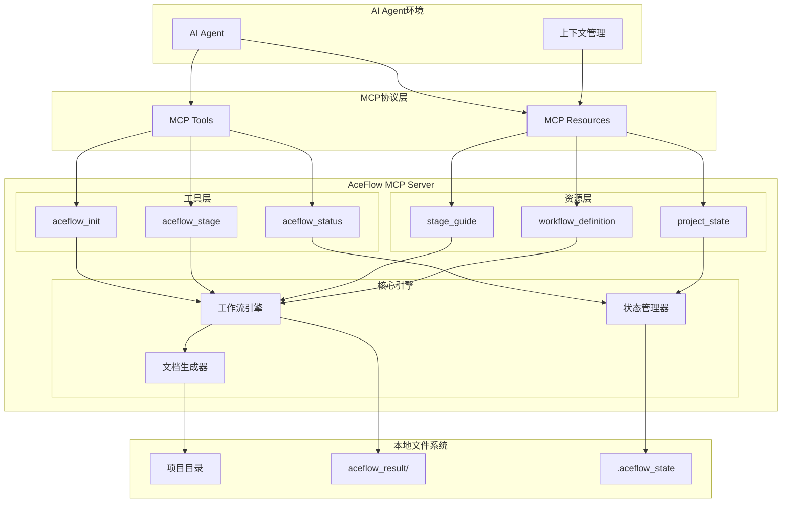
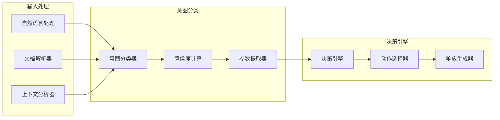
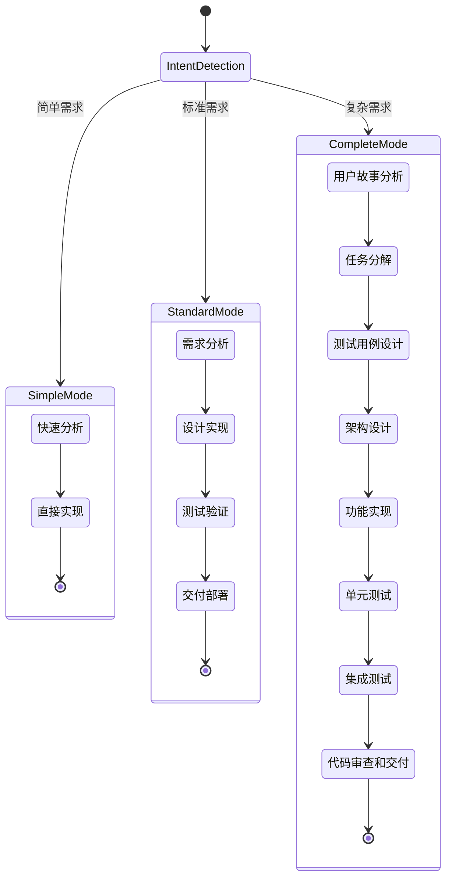
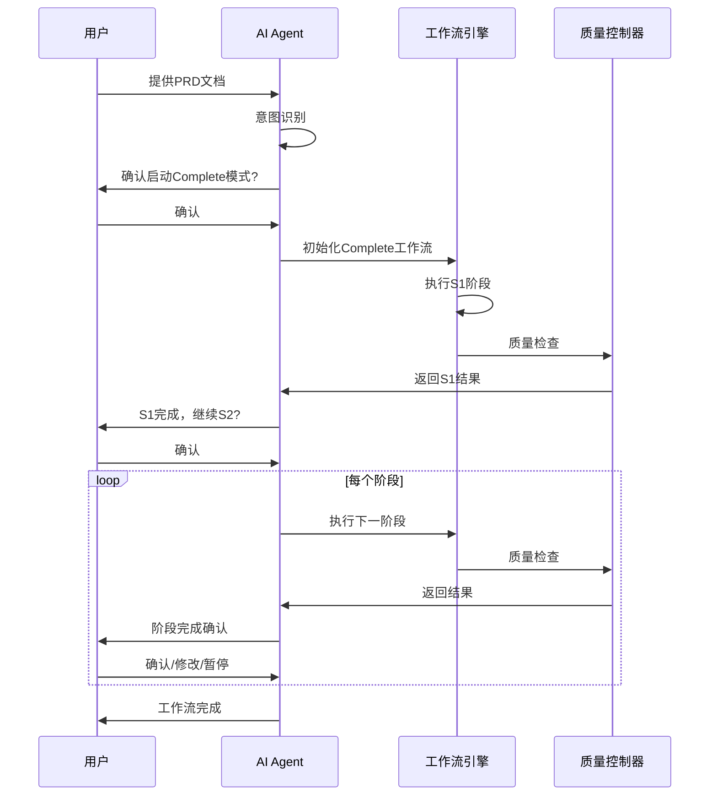
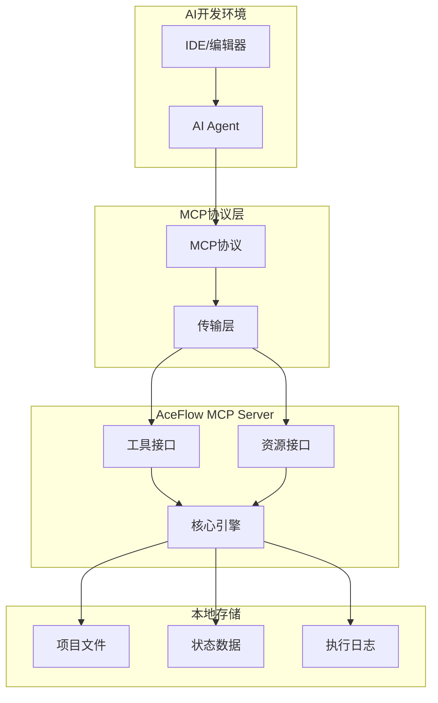

# AceFlow AI-人协同工作流系统设计

## 📋 概述

AceFlow AI-人协同工作流系统是基于现有aceflow-mcp-server的增强版本，通过MCP协议为AI Agent提供智能的软件开发流程管理能力。系统的核心理念是：**AI Agent能够智能识别用户意图，主动推进工作流程，在关键节点与用户协作确认，严格按照输入输出要求执行每个阶段**。

### 核心设计理念
- **基于现有MCP Server**: 在aceflow-mcp-server基础上增强AI-人协同能力
- **意图驱动**: AI Agent智能识别PRD文档等输入，自动启动相应工作流
- **主动推进**: 完成阶段后主动询问用户是否继续下一阶段
- **严格输入输出**: 每个阶段都有明确的输入要求和输出产物
- **任务级协作**: 在实现阶段逐个执行任务并征求用户确认

## 🏗️ 系统架构

### MCP Server架构图



### 基于现有MCP Server的增强设计

#### 1. 现有MCP Server能力
- **aceflow_init**: 项目初始化，支持4种模式(minimal/standard/complete/smart)
- **aceflow_stage**: 阶段管理(status/execute/next/reset)
- **aceflow_validate**: 项目质量验证
- **MCP Resources**: project_state, stage_guide, workflow_definition
- **.clinerules系统**: 为AI Agent提供工作指导

#### 2. 需要增强的AI-人协同能力

**智能意图识别增强**
- **基于现有**: 利用现有的.clinerules系统
- **增强功能**:
  - PRD文档自动检测和解析
  - 用户输入意图分类(启动流程/执行任务/查询状态)
  - 上下文理解和多轮对话管理

**主动工作流推进**
- **基于现有**: 利用aceflow_stage工具的next功能
- **增强功能**:
  - 阶段完成后主动询问用户确认
  - 智能推荐下一步操作
  - 协作节点的用户交互管理

**任务级协作执行**
- **基于现有**: 利用aceflow_stage的execute功能
- **增强功能**:
  - 任务分解文档解析
  - 逐个任务执行和确认
  - 实时进度更新和报告

**增强的资源利用**
- **基于现有**: 利用MCP Resources系统
- **增强功能**:
  - 动态获取项目状态信息
  - 智能选择合适的阶段指导
  - 基于状态的决策支持

## 🔧 核心组件详细设计

### 意图识别系统



**意图分类规则**:
- PRD文档检测 → 启动Complete模式工作流
- 任务执行请求 → 执行当前阶段任务
- 进度查询 → 返回项目状态信息
- 问题报告 → 进入问题解决流程

### 多模式工作流设计



### 协作交互设计



## 📊 数据模型设计

### 项目状态模型

```python
@dataclass
class ProjectState:
    project_id: str
    name: str
    mode: WorkflowMode  # Simple/Standard/Complete
    current_stage: str
    status: ProjectStatus  # Active/Paused/Completed/Failed
    created_at: datetime
    updated_at: datetime
    metadata: Dict[str, Any]

@dataclass
class StageState:
    stage_id: str
    project_id: str
    name: str
    status: StageStatus  # Pending/InProgress/Completed/Failed
    input_files: List[str]
    output_files: List[str]
    quality_score: float
    execution_time: float
    started_at: Optional[datetime]
    completed_at: Optional[datetime]
    warnings: List[str]
    errors: List[str]
```

### 工作流定义模型

```python
@dataclass
class WorkflowDefinition:
    mode: WorkflowMode
    stages: List[StageDefinition]
    dependencies: Dict[str, List[str]]
    
@dataclass
class StageDefinition:
    stage_id: str
    name: str
    description: str
    input_requirements: List[InputRequirement]
    output_specifications: List[OutputSpecification]
    quality_criteria: List[QualityCriterion]
    estimated_duration: int  # minutes
    ai_instructions: str
    human_checkpoints: List[str]
```

### 协作交互模型

```python
@dataclass
class CollaborationRequest:
    request_id: str
    project_id: str
    stage_id: str
    type: RequestType  # Confirmation/Input/Review/Decision
    title: str
    description: str
    options: List[str]
    default_option: Optional[str]
    timeout: Optional[int]
    created_at: datetime

@dataclass
class CollaborationResponse:
    request_id: str
    user_id: str
    response: str
    confidence: float
    additional_context: Optional[str]
    responded_at: datetime
```

## 🔄 接口设计

### AI Agent接口

```python
class AceFlowAgent:
    def detect_intent(self, user_input: str) -> IntentResult:
        """检测用户意图"""
        pass
    
    def start_workflow(self, intent: IntentResult, context: Dict) -> WorkflowResult:
        """启动工作流"""
        pass
    
    def execute_stage(self, project_id: str, stage_id: str) -> StageResult:
        """执行阶段"""
        pass
    
    def request_collaboration(self, request: CollaborationRequest) -> CollaborationResponse:
        """请求人机协作"""
        pass
    
    def get_project_status(self, project_id: str) -> ProjectState:
        """获取项目状态"""
        pass
```

### 工作流引擎接口

```python
class WorkflowEngine:
    def initialize_project(self, mode: WorkflowMode, config: Dict) -> str:
        """初始化项目"""
        pass
    
    def execute_stage(self, project_id: str, stage_id: str, inputs: Dict) -> StageResult:
        """执行阶段"""
        pass
    
    def validate_stage_inputs(self, stage_id: str, inputs: Dict) -> ValidationResult:
        """验证阶段输入"""
        pass
    
    def get_next_stage(self, project_id: str) -> Optional[str]:
        """获取下一阶段"""
        pass
    
    def pause_workflow(self, project_id: str) -> bool:
        """暂停工作流"""
        pass
    
    def resume_workflow(self, project_id: str) -> bool:
        """恢复工作流"""
        pass
```

### 资源管理接口

```python
class ResourceManager:
    def get_project_state(self, project_id: str) -> ProjectState:
        """获取项目状态"""
        pass
    
    def get_stage_guide(self, stage_id: str) -> StageGuide:
        """获取阶段指导"""
        pass
    
    def get_workflow_template(self, mode: WorkflowMode) -> WorkflowDefinition:
        """获取工作流模板"""
        pass
    
    def save_stage_output(self, project_id: str, stage_id: str, output: Dict) -> bool:
        """保存阶段输出"""
        pass
```

## 🛡️ 错误处理策略

### 错误分类和处理

```python
class ErrorHandler:
    def handle_intent_recognition_error(self, error: Exception) -> IntentResult:
        """处理意图识别错误"""
        # 降级到基础模式，请求用户澄清
        pass
    
    def handle_stage_execution_error(self, error: Exception, context: Dict) -> StageResult:
        """处理阶段执行错误"""
        # 尝试自动修复，失败则请求人工干预
        pass
    
    def handle_quality_check_failure(self, result: QualityResult) -> QualityResult:
        """处理质量检查失败"""
        # 自动改进或请求重新执行
        pass
    
    def handle_collaboration_timeout(self, request: CollaborationRequest) -> CollaborationResponse:
        """处理协作超时"""
        # 使用默认选项或暂停工作流
        pass
```

### 恢复机制

1. **状态快照**: 每个阶段完成后自动保存状态快照
2. **增量恢复**: 从最近的有效状态点恢复执行
3. **回滚机制**: 支持回退到任意历史状态
4. **手动干预**: 提供手动修复和调整接口

## 🧪 测试策略

### 单元测试

- **意图识别测试**: 测试各种输入场景的意图识别准确性
- **工作流引擎测试**: 测试各种工作流模式的执行逻辑
- **状态管理测试**: 测试状态持久化和恢复机制
- **质量控制测试**: 测试质量评估和控制逻辑

### 集成测试

- **端到端工作流测试**: 测试完整的S1-S8工作流执行
- **多模式切换测试**: 测试不同工作流模式间的切换
- **协作交互测试**: 测试AI-人协作的各种场景
- **错误恢复测试**: 测试各种错误场景的恢复能力

### 性能测试

- **响应时间测试**: 确保AI响应时间≤3秒
- **并发处理测试**: 测试多项目并发执行能力
- **资源使用测试**: 监控内存和CPU使用情况
- **扩展性测试**: 测试系统的水平扩展能力

## 📈 监控和度量

### 关键指标

1. **功能指标**:
   - 意图识别准确率 ≥ 95%
   - 工作流完成率 ≥ 90%
   - 输出质量评分 ≥ 80分

2. **性能指标**:
   - AI响应时间 ≤ 3秒
   - 系统可用性 ≥ 99.5%
   - 阶段执行成功率 ≥ 95%

3. **用户体验指标**:
   - 用户满意度 ≥ 4.5/5.0
   - 协作响应时间 ≤ 5秒
   - 错误恢复时间 ≤ 30秒

### 监控系统

```python
class MonitoringSystem:
    def track_intent_accuracy(self, predicted: str, actual: str):
        """跟踪意图识别准确性"""
        pass
    
    def track_stage_performance(self, stage_id: str, duration: float, quality: float):
        """跟踪阶段执行性能"""
        pass
    
    def track_user_satisfaction(self, project_id: str, rating: float, feedback: str):
        """跟踪用户满意度"""
        pass
    
    def generate_analytics_report(self, period: str) -> AnalyticsReport:
        """生成分析报告"""
        pass
```

## 🔐 安全设计

### 数据安全

1. **加密存储**: 所有项目数据使用AES-256加密存储
2. **访问控制**: 基于角色的访问控制(RBAC)
3. **审计日志**: 完整的操作审计日志记录
4. **数据备份**: 自动化的数据备份和恢复机制

### 系统安全

1. **输入验证**: 严格的输入验证和清理
2. **权限隔离**: 不同项目间的权限隔离
3. **安全通信**: 所有通信使用HTTPS/TLS加密
4. **漏洞扫描**: 定期的安全漏洞扫描和修复

## 🚀 MCP Server架构

### MCP Server部署模式



### MCP Server特点

1. **轻量级部署**: 作为单一MCP Server进程运行，无需复杂的服务架构
2. **本地化存储**: 项目数据存储在本地文件系统，无需外部数据库
3. **标准协议**: 通过MCP协议与AI Agent通信，兼容各种AI开发环境
4. **即插即用**: 通过简单配置即可集成到现有开发工具链

### 部署方式

```python
# 通过uvx直接运行
uvx aceflow-mcp-server

# 或通过Python包管理器安装
pip install aceflow-mcp-server
aceflow-server --port 8000
```

### 配置示例

```json
{
  "mcpServers": {
    "aceflow": {
      "command": "uvx",
      "args": ["aceflow-mcp-server@latest"],
      "env": {
        "ACEFLOW_WORKSPACE": "./",
        "ACEFLOW_LOG_LEVEL": "INFO"
      },
      "disabled": false,
      "autoApprove": ["aceflow_init", "aceflow_stage"]
    }
  }
}
```

这个设计文档提供了AceFlow AI-人协同工作流系统的完整技术架构和实现方案，确保系统能够满足所有需求并具备良好的可扩展性和可维护性。