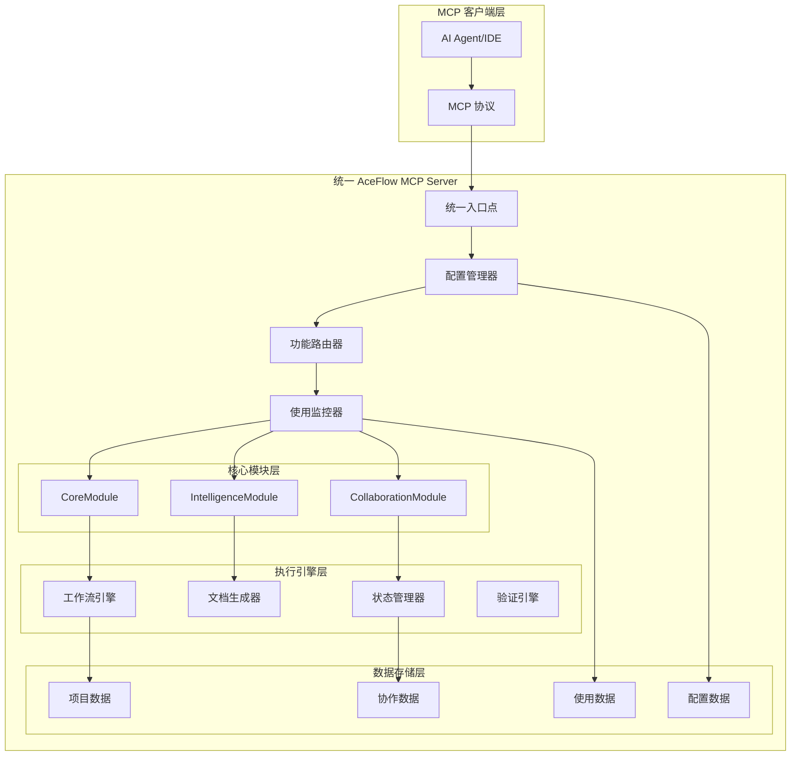
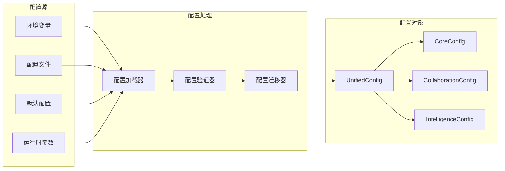
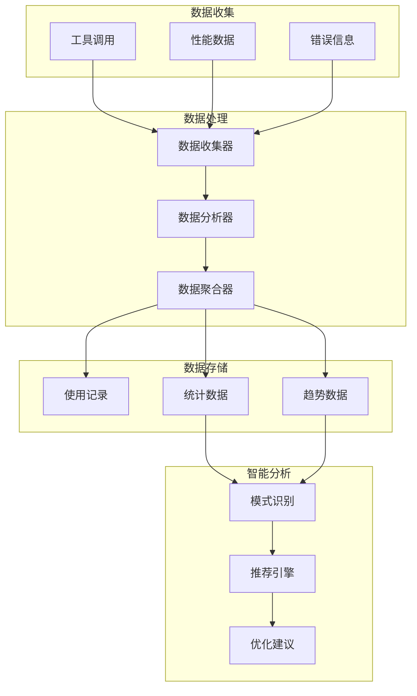
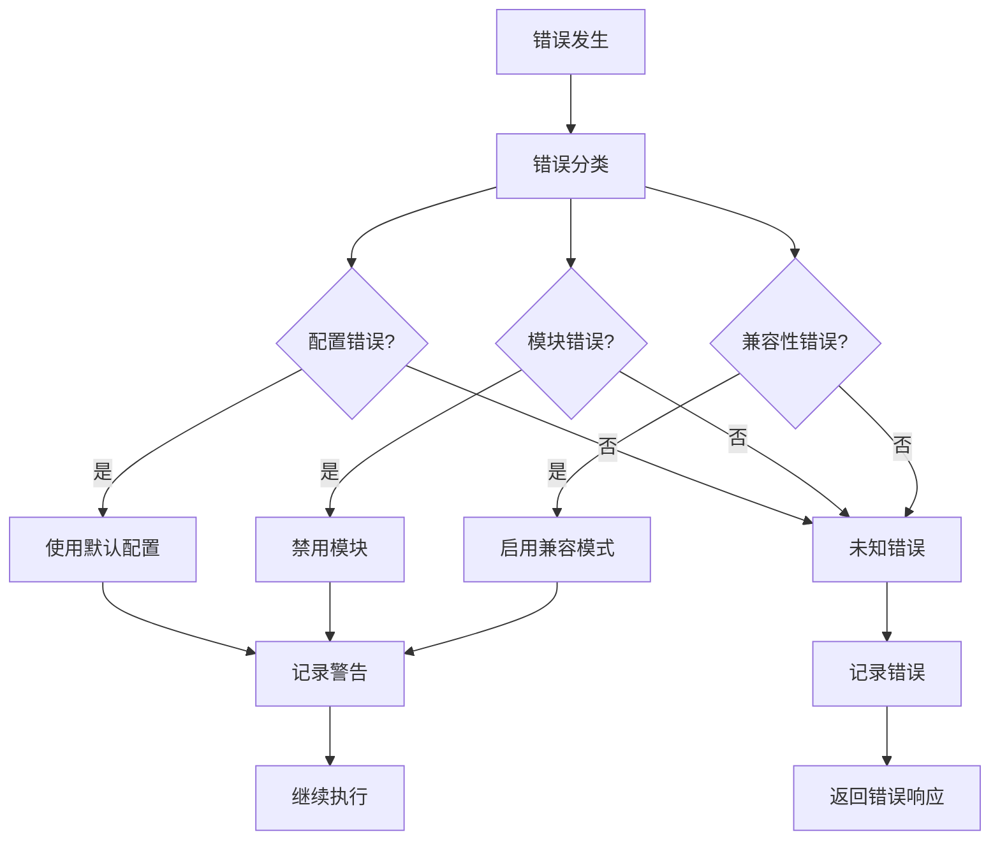

# AceFlow MCP Server 统一架构设计文档

## 📋 概述

本文档详细设计了 AceFlow MCP Server 的统一架构，将现有的双服务器架构整合为单一的、可配置的、模块化的解决方案。设计遵循渐进式演进原则，确保向后兼容性的同时为未来发展奠定基础。

## 🎯 设计原则

### 核心原则
1. **向后兼容优先**: 现有用户零成本迁移
2. **渐进式复杂度**: 用户可按需启用功能
3. **模块化设计**: 功能独立，职责清晰
4. **配置驱动**: 行为通过配置控制
5. **性能优先**: 基础模式保持高性能

### 架构原则
1. **单一入口**: 统一的服务器入口点
2. **智能路由**: 根据参数智能选择执行路径
3. **懒加载**: 按需加载功能模块
4. **优雅降级**: 功能不可用时自动降级
5. **数据驱动**: 基于使用数据优化配置

## 🏗️ 整体架构设计

### 系统架构图



### 模块职责矩阵

| 模块 | 主要职责 | 输入 | 输出 | 依赖 |
|------|---------|------|------|------|
| **统一入口点** | MCP 协议处理、工具注册 | MCP 请求 | MCP 响应 | 配置管理器 |
| **配置管理器** | 配置加载、验证、迁移 | 配置文件/环境变量 | 统一配置对象 | 无 |
| **功能路由器** | 执行计划生成、路径选择 | 工具调用参数 | 执行计划 | 配置管理器 |
| **使用监控器** | 数据收集、分析、建议 | 使用记录 | 统计报告 | 配置管理器 |
| **CoreModule** | 基础工具实现 | 工具参数 | 执行结果 | 工作流引擎 |
| **CollaborationModule** | 协作功能实现 | 协作请求 | 协作响应 | 状态管理器 |
| **IntelligenceModule** | 智能功能实现 | 用户输入 | 意图分析 | 文档生成器 |

## 🔧 核心组件详细设计

### 1. 统一入口点设计

```python
class UnifiedAceFlowServer:
    """统一的 AceFlow MCP 服务器"""
    
    def __init__(self, config: Optional[UnifiedConfig] = None):
        # 配置管理
        self.config = config or load_unified_config()
        
        # MCP 服务器实例
        self.mcp = FastMCP("AceFlow-Unified")
        
        # 核心组件
        self.router = FunctionRouter(self.config)
        self.monitor = UsageMonitor(self.config.monitoring)
        
        # 功能模块（懒加载）
        self._core_module = None
        self._collab_module = None
        self._intel_module = None
        
        # 注册接口
        self._register_tools()
        self._register_resources()
    
    @property
    def core_module(self) -> CoreModule:
        """懒加载核心模块"""
        if self._core_module is None:
            self._core_module = CoreModule(self.config.core)
        return self._core_module
    
    @property
    def collab_module(self) -> CollaborationModule:
        """懒加载协作模块"""
        if self._collab_module is None and self.config.collaboration.enabled:
            self._collab_module = CollaborationModule(self.config.collaboration)
        return self._collab_module
    
    @property
    def intel_module(self) -> IntelligenceModule:
        """懒加载智能模块"""
        if self._intel_module is None and self.config.intelligence.enabled:
            self._intel_module = IntelligenceModule(self.config.intelligence)
        return self._intel_module
```

### 2. 配置管理设计



**配置优先级**:
1. 运行时参数（最高优先级）
2. 环境变量
3. 配置文件
4. 默认配置（最低优先级）

### 3. 功能路由器设计

```python
class FunctionRouter:
    """智能功能路由器"""
    
    def plan_execution(self, tool_name: str, params: Dict[str, Any]) -> ExecutionPlan:
        """生成执行计划"""
        
        # 分析参数特征
        features = self._analyze_parameters(params)
        
        # 决策执行模式
        mode = self._decide_execution_mode(features)
        
        # 生成执行计划
        return ExecutionPlan(
            mode=mode,
            primary_module=self._get_primary_module(tool_name),
            enhancement_modules=self._get_enhancement_modules(mode, features),
            parameters=params,
            metadata=self._generate_metadata(tool_name, mode, features)
        )
    
    def _analyze_parameters(self, params: Dict[str, Any]) -> ParameterFeatures:
        """分析参数特征"""
        return ParameterFeatures(
            has_user_input=bool(params.get('user_input')),
            requests_collaboration=params.get('collaboration_mode') == 'enhanced',
            requests_intelligence=bool(params.get('user_input')),
            auto_confirm=params.get('auto_confirm', False),
            validation_level=params.get('validation_level', 'basic')
        )
    
    def _decide_execution_mode(self, features: ParameterFeatures) -> ExecutionMode:
        """决策执行模式"""
        if not self.config.collaboration.enabled and not self.config.intelligence.enabled:
            return ExecutionMode.CORE_ONLY
        
        needs_collab = (
            self.config.collaboration.enabled and
            (features.requests_collaboration or 
             (features.has_user_input and not features.auto_confirm))
        )
        
        needs_intel = (
            self.config.intelligence.enabled and
            features.has_user_input and
            self.config.intelligence.intent_recognition
        )
        
        if needs_collab and needs_intel:
            return ExecutionMode.FULL_ENHANCED
        elif needs_collab:
            return ExecutionMode.CORE_WITH_COLLABORATION
        elif needs_intel:
            return ExecutionMode.CORE_WITH_INTELLIGENCE
        else:
            return ExecutionMode.CORE_ONLY
```

### 4. 模块接口设计

```python
class BaseModule(ABC):
    """模块基类"""
    
    def __init__(self, config: Any):
        self.config = config
        self.enabled = getattr(config, 'enabled', True)
        self._initialized = False
    
    @abstractmethod
    def get_module_name(self) -> str:
        """获取模块名称"""
        pass
    
    @abstractmethod
    def initialize(self) -> bool:
        """初始化模块"""
        pass
    
    @abstractmethod
    def cleanup(self):
        """清理模块资源"""
        pass
    
    def ensure_initialized(self):
        """确保模块已初始化"""
        if not self._initialized and self.enabled:
            self._initialized = self.initialize()
    
    def is_available(self) -> bool:
        """检查模块是否可用"""
        return self.enabled and self._initialized
```

### 5. 使用监控设计



## 📊 数据模型设计

### 配置数据模型

```python
@dataclass
class UnifiedConfig:
    mode: str  # basic, standard, enhanced, auto
    core: CoreConfig
    collaboration: CollaborationConfig
    intelligence: IntelligenceConfig
    monitoring: MonitoringConfig

@dataclass
class CoreConfig:
    enabled: bool = True
    default_mode: str = "standard"
    auto_advance: bool = False
    quality_threshold: float = 0.8

@dataclass
class CollaborationConfig:
    enabled: bool = False
    confirmation_timeout: int = 300
    auto_confirm: bool = False
    interaction_level: str = "standard"

@dataclass
class IntelligenceConfig:
    enabled: bool = False
    intent_recognition: bool = True
    adaptive_guidance: bool = True
    learning_enabled: bool = False
```

### 执行计划数据模型

```python
@dataclass
class ExecutionPlan:
    mode: ExecutionMode
    primary_module: str
    enhancement_modules: List[str]
    parameters: Dict[str, Any]
    metadata: Dict[str, Any]

class ExecutionMode(Enum):
    CORE_ONLY = "core_only"
    CORE_WITH_COLLABORATION = "core_with_collaboration"
    CORE_WITH_INTELLIGENCE = "core_with_intelligence"
    FULL_ENHANCED = "full_enhanced"

@dataclass
class ParameterFeatures:
    has_user_input: bool
    requests_collaboration: bool
    requests_intelligence: bool
    auto_confirm: bool
    validation_level: str
```

### 监控数据模型

```python
@dataclass
class UsageRecord:
    timestamp: datetime
    tool_name: str
    parameters: Dict[str, Any]
    execution_mode: str
    duration_ms: float
    success: bool
    error: Optional[str] = None

@dataclass
class UsageStats:
    total_calls: int = 0
    successful_calls: int = 0
    failed_calls: int = 0
    avg_duration_ms: float = 0.0
    mode_distribution: Dict[str, int] = field(default_factory=dict)
    tool_distribution: Dict[str, int] = field(default_factory=dict)
```

## 🔄 接口设计

### MCP 工具接口

#### 统一核心工具

```python
@mcp.tool
def aceflow_init(
    mode: str,
    project_name: Optional[str] = None,
    directory: Optional[str] = None,
    # 新增统一配置参数
    collaboration_enabled: Optional[bool] = None,
    intelligence_enabled: Optional[bool] = None
) -> Dict[str, Any]:
    """🚀 Initialize AceFlow project with unified configuration."""

@mcp.tool
def aceflow_stage(
    action: str,
    stage: Optional[str] = None,
    # 原有参数保持兼容
    
    # 新增协作参数
    user_input: Optional[str] = None,
    auto_confirm: Optional[bool] = None,
    collaboration_mode: Optional[str] = None
) -> Dict[str, Any]:
    """📊 Unified stage management with optional collaboration."""

@mcp.tool
def aceflow_validate(
    mode: str = "basic",
    fix: bool = False,
    report: bool = False,
    # 新增智能验证参数
    validation_level: Optional[str] = None,
    generate_report: Optional[bool] = None
) -> Dict[str, Any]:
    """✅ Unified project validation with enhanced quality checks."""
```

#### 协作专用工具

```python
@mcp.tool
def aceflow_respond(
    request_id: str,
    response: str,
    user_id: str = "user"
) -> Dict[str, Any]:
    """💬 Respond to collaboration requests."""

@mcp.tool
def aceflow_collaboration_status(
    project_id: Optional[str] = None
) -> Dict[str, Any]:
    """📊 Get collaboration status and insights."""

@mcp.tool
def aceflow_task_execute(
    task_id: Optional[str] = None,
    auto_confirm: bool = False
) -> Dict[str, Any]:
    """📋 Execute tasks with collaborative confirmation."""
```

#### 智能专用工具

```python
@mcp.tool
def aceflow_intent_analyze(
    user_input: str,
    context: Optional[Dict[str, Any]] = None
) -> Dict[str, Any]:
    """🧠 Analyze user intent and suggest actions."""

@mcp.tool
def aceflow_recommend(
    context: Optional[Dict[str, Any]] = None
) -> Dict[str, Any]:
    """💡 Get intelligent recommendations for next actions."""
```

### MCP 资源接口

#### 核心资源

```python
@mcp.resource("aceflow://project/state/{project_id}")
def project_state(project_id: str = "current") -> str:
    """Get current project state."""

@mcp.resource("aceflow://workflow/config/{config_id}")
def workflow_config(config_id: str = "default") -> str:
    """Get workflow configuration."""

@mcp.resource("aceflow://stage/guide/{stage}")
def stage_guide(stage: str) -> str:
    """Get stage-specific guidance."""
```

#### 增强资源

```python
@mcp.resource("aceflow://project/intelligent-state/{project_id}")
def intelligent_project_state(project_id: str = "current") -> str:
    """Get intelligent project state with recommendations."""

@mcp.resource("aceflow://collaboration/insights/{project_id}")
def collaboration_insights(project_id: str = "current") -> str:
    """Get collaboration insights and analytics."""

@mcp.resource("aceflow://monitoring/usage-stats")
def usage_stats() -> str:
    """Get usage statistics and recommendations."""
```

## 🛡️ 错误处理策略

### 错误分类

```python
class AceFlowError(Exception):
    """AceFlow 基础错误"""
    pass

class ConfigurationError(AceFlowError):
    """配置错误"""
    pass

class ModuleNotAvailableError(AceFlowError):
    """模块不可用错误"""
    pass

class CompatibilityError(AceFlowError):
    """兼容性错误"""
    pass
```

### 错误处理流程



## 🧪 测试策略

### 测试层次

1. **单元测试**: 每个模块独立测试
2. **集成测试**: 模块间交互测试
3. **兼容性测试**: 向后兼容性验证
4. **性能测试**: 性能基准验证
5. **端到端测试**: 完整工作流测试

### 测试覆盖

```python
# 配置管理测试
def test_config_loading():
    """测试配置加载"""
    pass

def test_config_migration():
    """测试配置迁移"""
    pass

# 模块测试
def test_core_module():
    """测试核心模块"""
    pass

def test_collaboration_module():
    """测试协作模块"""
    pass

# 路由测试
def test_function_routing():
    """测试功能路由"""
    pass

# 兼容性测试
def test_backward_compatibility():
    """测试向后兼容性"""
    pass
```

## 📈 性能优化设计

### 优化策略

1. **懒加载**: 模块按需加载
2. **缓存机制**: 配置和状态缓存
3. **异步处理**: 非关键路径异步执行
4. **资源池**: 复用昂贵资源
5. **智能预加载**: 基于使用模式预加载

### 性能监控

```python
class PerformanceMonitor:
    """性能监控器"""
    
    def track_execution_time(self, tool_name: str, duration: float):
        """跟踪执行时间"""
        pass
    
    def track_memory_usage(self, module_name: str, memory_mb: float):
        """跟踪内存使用"""
        pass
    
    def generate_performance_report(self) -> Dict[str, Any]:
        """生成性能报告"""
        pass
```

## 🔐 安全设计

### 安全原则

1. **最小权限**: 模块只访问必需资源
2. **输入验证**: 严格验证所有输入
3. **数据隔离**: 项目数据严格隔离
4. **配置安全**: 敏感配置加密存储
5. **审计日志**: 记录关键操作

### 安全实现

```python
class SecurityManager:
    """安全管理器"""
    
    def validate_input(self, input_data: Any) -> bool:
        """验证输入数据"""
        pass
    
    def encrypt_sensitive_config(self, config: Dict[str, Any]) -> Dict[str, Any]:
        """加密敏感配置"""
        pass
    
    def audit_log(self, operation: str, user: str, details: Dict[str, Any]):
        """记录审计日志"""
        pass
```

## 🚀 部署架构

### 部署模式

1. **单机部署**: 本地开发环境
2. **容器部署**: Docker 容器化部署
3. **云端部署**: 云服务器部署
4. **集群部署**: 高可用集群部署

### 配置管理

```yaml
# docker-compose.yml
version: '3.8'
services:
  aceflow-mcp:
    image: aceflow/mcp-server:unified
    environment:
      - ACEFLOW_MODE=enhanced
      - ACEFLOW_COLLABORATION_ENABLED=true
      - ACEFLOW_INTELLIGENCE_ENABLED=true
    volumes:
      - ./config:/app/config
      - ./data:/app/data
    ports:
      - "8000:8000"
```

---

*设计文档版本: 1.0*  
*创建时间: 2024-01-XX*  
*最后更新: 2024-01-XX*