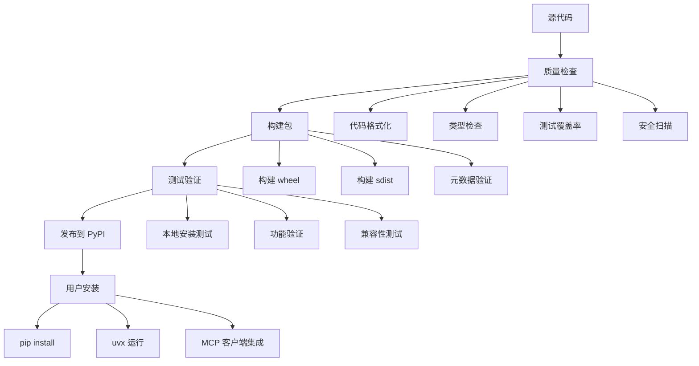

# AceFlow MCP Server PyPI 发布设计文档

## Overview

本设计文档描述了将 AceFlow MCP Server 成功发布到 PyPI 的完整架构和实施方案。项目已经具备了基本的功能和测试覆盖，现在需要完善发布流程、文档和质量保证机制。

## Architecture

### 发布架构图



### 组件架构

#### 1. 包结构设计
```
aceflow-mcp-server/
├── aceflow_mcp_server/          # 主包
│   ├── __init__.py             # 包初始化
│   ├── __main__.py             # 命令行入口
│   ├── main.py                 # 主程序入口
│   ├── server.py               # MCP 服务器实现
│   ├── tools.py                # 工具实现
│   ├── resources.py            # 资源实现
│   ├── prompts.py              # 提示词实现
│   └── core/                   # 核心功能模块
├── tests/                      # 测试套件
├── docs/                       # 文档
├── scripts/                    # 构建和部署脚本
├── pyproject.toml              # 项目配置
├── README.md                   # 项目说明
└── LICENSE                     # 许可证
```

#### 2. 入口点设计
- **命令行入口**: `aceflow-mcp-server` 命令
- **模块入口**: `python -m aceflow_mcp_server`
- **uvx 支持**: 直接通过 `uvx aceflow-mcp-server` 运行

## Components and Interfaces

### 1. 构建系统
- **构建后端**: Hatchling (现代 Python 构建系统)
- **包格式**: Wheel + Source Distribution
- **元数据**: 符合 PEP 621 标准的 pyproject.toml

### 2. 质量保证组件

#### 代码质量工具
- **格式化**: Black (代码格式化)
- **导入排序**: isort (导入语句排序)
- **类型检查**: MyPy (静态类型检查)
- **代码检查**: Flake8 (代码风格检查)

#### 测试框架
- **测试运行器**: pytest
- **覆盖率**: pytest-cov
- **目标覆盖率**: 80% 以上

### 3. 发布流程组件

#### 自动化脚本
- **构建脚本**: `scripts/build/build_package.py`
- **发布脚本**: `scripts/deploy/deploy_to_pypi.sh`
- **验证脚本**: `scripts/build/check_publish_readiness.py`

#### CI/CD 集成
- **本地验证**: 完整的预发布检查
- **版本管理**: 语义化版本控制
- **发布验证**: 自动化的发布后验证

### 4. 文档系统

#### 用户文档
- **README.md**: 项目概述和快速开始
- **安装指南**: 详细的安装说明
- **使用指南**: 工具使用说明
- **配置指南**: MCP 客户端配置

#### 开发者文档
- **API 文档**: 工具和资源 API 说明
- **贡献指南**: 开发环境设置和贡献流程
- **发布指南**: 版本发布流程

## Data Models

### 1. 包元数据模型
```python
PackageMetadata = {
    "name": "aceflow-mcp-server",
    "version": "1.0.4",
    "description": "AceFlow MCP Server for AI-driven workflow management",
    "author": "AceFlow Team",
    "license": "MIT",
    "python_requires": ">=3.8",
    "dependencies": [
        "fastmcp>=0.1.0",
        "pydantic>=2.0.0",
        "pyyaml>=6.0",
        "click>=8.0.0",
        "rich>=13.0.0"
    ]
}
```

### 2. 发布配置模型
```python
PublishConfig = {
    "repository": "https://upload.pypi.org/legacy/",
    "test_repository": "https://test.pypi.org/legacy/",
    "build_formats": ["wheel", "sdist"],
    "quality_checks": {
        "test_coverage": 80,
        "type_check": True,
        "format_check": True,
        "security_scan": True
    }
}
```

### 3. 验证结果模型
```python
ValidationResult = {
    "package_build": bool,
    "test_results": {
        "passed": int,
        "failed": int,
        "coverage": float
    },
    "quality_checks": {
        "formatting": bool,
        "type_checking": bool,
        "linting": bool
    },
    "installation_test": bool,
    "functional_test": bool
}
```

## Error Handling

### 1. 构建错误处理
- **依赖冲突**: 自动检测和报告依赖版本冲突
- **构建失败**: 详细的错误日志和修复建议
- **元数据错误**: 验证和修复包元数据

### 2. 发布错误处理
- **认证失败**: PyPI 认证问题的诊断和解决
- **上传失败**: 网络问题和重试机制
- **版本冲突**: 版本号冲突的检测和处理

### 3. 安装错误处理
- **依赖安装失败**: 依赖问题的诊断
- **权限问题**: 安装权限问题的解决方案
- **环境兼容性**: Python 版本兼容性检查

## Testing Strategy

### 1. 单元测试
- **覆盖率目标**: 80% 以上
- **测试范围**: 所有核心功能模块
- **测试环境**: Python 3.8-3.12

### 2. 集成测试
- **MCP 协议测试**: 验证 MCP 服务器功能
- **工具集成测试**: 验证所有工具的端到端功能
- **资源访问测试**: 验证资源提供功能

### 3. 发布测试
- **包构建测试**: 验证包能正确构建
- **安装测试**: 验证包能正确安装
- **功能测试**: 验证安装后的功能完整性

### 4. 兼容性测试
- **Python 版本**: 测试 Python 3.8-3.12 兼容性
- **操作系统**: 测试 Windows/Linux/macOS 兼容性
- **MCP 客户端**: 测试与主流 MCP 客户端的兼容性

## Quality Assurance

### 1. 代码质量标准
- **格式化**: 使用 Black 统一代码格式
- **类型注解**: 所有公共 API 必须有类型注解
- **文档字符串**: 所有公共函数必须有文档字符串
- **代码复杂度**: 控制函数和类的复杂度

### 2. 测试质量标准
- **测试覆盖率**: 核心功能 90% 以上，总体 80% 以上
- **测试质量**: 测试用例必须覆盖正常和异常情况
- **测试维护**: 测试代码必须易于理解和维护

### 3. 文档质量标准
- **完整性**: 所有功能都有对应的文档
- **准确性**: 文档内容与实际功能一致
- **易用性**: 文档结构清晰，易于查找和理解

### 4. 发布质量标准
- **版本管理**: 遵循语义化版本控制
- **变更日志**: 每个版本都有详细的变更记录
- **向后兼容**: 保持 API 的向后兼容性

## Security Considerations

### 1. 依赖安全
- **依赖扫描**: 定期扫描依赖包的安全漏洞
- **版本锁定**: 锁定依赖版本避免供应链攻击
- **最小依赖**: 只包含必要的依赖包

### 2. 发布安全
- **认证安全**: 使用 API Token 而不是密码
- **传输安全**: 使用 HTTPS 进行包上传
- **签名验证**: 考虑包签名验证

### 3. 运行时安全
- **输入验证**: 验证所有外部输入
- **权限控制**: 最小权限原则
- **错误处理**: 避免敏感信息泄露

## Performance Considerations

### 1. 包大小优化
- **文件排除**: 排除不必要的文件
- **依赖优化**: 选择轻量级的依赖
- **压缩优化**: 优化包的压缩效率

### 2. 安装性能
- **依赖解析**: 优化依赖解析速度
- **缓存利用**: 利用 pip 缓存机制
- **并行安装**: 支持并行依赖安装

### 3. 运行时性能
- **启动时间**: 优化服务器启动时间
- **内存使用**: 控制内存占用
- **响应时间**: 优化工具调用响应时间

## Deployment Strategy

### 1. 发布环境
- **测试环境**: TestPyPI 用于预发布测试
- **生产环境**: PyPI 用于正式发布
- **版本策略**: 语义化版本控制

### 2. 发布流程
1. **预发布检查**: 运行完整的质量检查
2. **构建包**: 生成 wheel 和 sdist
3. **测试发布**: 先发布到 TestPyPI
4. **验证测试**: 从 TestPyPI 安装并测试
5. **正式发布**: 发布到 PyPI
6. **发布验证**: 验证正式发布的功能

### 3. 回滚策略
- **版本回退**: 如果发现严重问题，发布修复版本
- **文档更新**: 及时更新文档和变更日志
- **用户通知**: 通过适当渠道通知用户

## Monitoring and Maintenance

### 1. 发布监控
- **下载统计**: 监控包的下载量和使用情况
- **错误报告**: 收集和分析用户反馈
- **性能监控**: 监控包的性能表现

### 2. 维护策略
- **定期更新**: 定期更新依赖和修复问题
- **安全更新**: 及时修复安全漏洞
- **功能增强**: 根据用户反馈增加新功能

### 3. 社区支持
- **问题跟踪**: 通过 GitHub Issues 跟踪问题
- **文档维护**: 保持文档的时效性
- **用户支持**: 提供及时的用户支持