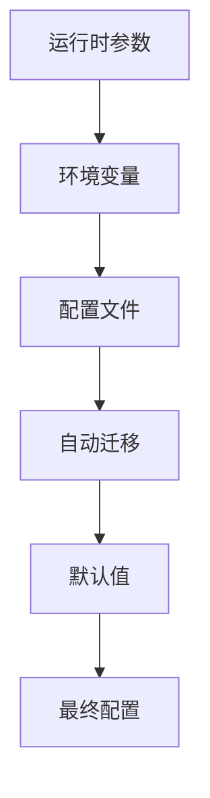

# AceFlow MCP 统一服务器配置参考

> 📖 **完整配置指南** - 详细的配置选项和最佳实践

## 📋 目录

- [配置概述](#配置概述)
- [配置优先级](#配置优先级)
- [运行模式](#运行模式)
- [核心配置](#核心配置)
- [协作配置](#协作配置)
- [智能配置](#智能配置)
- [监控配置](#监控配置)
- [环境变量](#环境变量)
- [配置文件格式](#配置文件格式)
- [配置验证](#配置验证)
- [最佳实践](#最佳实践)

## 🔧 配置概述

AceFlow MCP 统一服务器支持多种配置方式，提供灵活的定制选项以满足不同使用场景的需求。

### 配置方式

1. **环境变量** - 快速设置和容器化部署
2. **配置文件** - 详细配置和版本控制
3. **运行时参数** - 临时覆盖和测试
4. **自动迁移** - 从旧版本无缝升级

## 📊 配置优先级

配置按以下优先级应用（从高到低）：

1. **运行时参数** - 命令行或API传入的参数
2. **环境变量** - 系统环境变量
3. **配置文件** - 指定的配置文件
4. **自动迁移** - 从旧配置自动迁移
5. **默认值** - 内置默认配置



## 🎯 运行模式

### 模式概述

| 模式 | 核心功能 | 协作功能 | 智能功能 | 监控功能 | 适用场景 |
|------|----------|----------|----------|----------|----------|
| `basic` | ✅ | ❌ | ❌ | ✅ | 简单项目，快速原型 |
| `standard` | ✅ | 可选 | 可选 | ✅ | 大多数项目，平衡性能 |
| `enhanced` | ✅ | ✅ | ✅ | ✅ | 复杂项目，团队协作 |
| `auto` | ✅ | 自动 | 自动 | ✅ | 智能适应，动态调整 |

### 模式配置

```bash
# 环境变量方式
export ACEFLOW_MODE=enhanced

# 配置文件方式
{
  "mode": "enhanced"
}

# 运行时参数方式
aceflow-unified --mode enhanced
```

## ⚙️ 核心配置

核心配置控制基础功能的行为。

### 配置选项

```json
{
  "core": {
    "enabled": true,
    "default_mode": "standard",
    "auto_advance": false,
    "quality_threshold": 0.8
  }
}
```

### 详细说明

#### `enabled` (boolean, 默认: true)
- **描述**: 是否启用核心功能
- **影响**: 禁用后所有基础工具不可用
- **建议**: 始终保持启用

#### `default_mode` (string, 默认: "standard")
- **描述**: 工具的默认执行模式
- **可选值**: "minimal", "standard", "complete", "smart"
- **影响**: 影响 `aceflow_init` 等工具的默认行为

#### `auto_advance` (boolean, 默认: false)
- **描述**: 是否自动推进项目阶段
- **影响**: 启用后完成当前阶段时自动进入下一阶段
- **注意**: 可能影响用户控制，谨慎启用

#### `quality_threshold` (number, 默认: 0.8)
- **描述**: 质量检查的阈值 (0.0-1.0)
- **影响**: 影响验证工具的严格程度
- **建议**: 0.7-0.9 之间，根据项目要求调整

### 环境变量

```bash
export ACEFLOW_CORE_ENABLED=true
export ACEFLOW_DEFAULT_MODE=standard
export ACEFLOW_AUTO_ADVANCE=false
export ACEFLOW_QUALITY_THRESHOLD=0.8
```

## 🤝 协作配置

协作配置控制团队协作功能。

### 配置选项

```json
{
  "collaboration": {
    "enabled": false,
    "confirmation_timeout": 30,
    "auto_confirm": false,
    "interaction_level": "standard"
  }
}
```

### 详细说明

#### `enabled` (boolean, 默认: false)
- **描述**: 是否启用协作功能
- **影响**: 控制协作工具的可用性
- **模式关联**: 
  - `basic`: 强制 false
  - `enhanced`: 强制 true
  - `standard`: 可配置

#### `confirmation_timeout` (number, 默认: 30)
- **描述**: 协作确认的超时时间（秒）
- **范围**: 5-300 秒
- **影响**: 超时后自动取消或确认操作

#### `auto_confirm` (boolean, 默认: false)
- **描述**: 是否自动确认协作请求
- **影响**: 启用后减少用户交互，提高效率
- **风险**: 可能导致意外操作，建议仅在信任环境使用

#### `interaction_level` (string, 默认: "standard")
- **描述**: 协作交互的详细程度
- **可选值**: 
  - `"minimal"`: 最少交互，仅关键确认
  - `"standard"`: 标准交互，平衡效率和控制
  - `"full"`: 完整交互，最大用户控制
- **建议**: 根据团队经验和项目复杂度选择

### 环境变量

```bash
export ACEFLOW_COLLABORATION_ENABLED=true
export ACEFLOW_CONFIRMATION_TIMEOUT=30
export ACEFLOW_AUTO_CONFIRM=false
export ACEFLOW_INTERACTION_LEVEL=standard
```

## 🧠 智能配置

智能配置控制AI增强功能。

### 配置选项

```json
{
  "intelligence": {
    "enabled": false,
    "intent_recognition": true,
    "adaptive_guidance": true,
    "learning_enabled": false
  }
}
```

### 详细说明

#### `enabled` (boolean, 默认: false)
- **描述**: 是否启用智能功能
- **影响**: 控制智能工具的可用性
- **模式关联**:
  - `basic`: 强制 false
  - `enhanced`: 强制 true
  - `standard`: 可配置

#### `intent_recognition` (boolean, 默认: true)
- **描述**: 是否启用意图识别
- **影响**: 影响 `aceflow_intent_analyze` 工具的准确性
- **性能**: 启用后可能增加响应时间

#### `adaptive_guidance` (boolean, 默认: true)
- **描述**: 是否提供自适应指导
- **影响**: 根据用户行为调整建议
- **隐私**: 需要收集使用模式数据

#### `learning_enabled` (boolean, 默认: false)
- **描述**: 是否启用机器学习
- **影响**: 系统会从用户交互中学习
- **注意**: 实验性功能，可能影响稳定性

### 环境变量

```bash
export ACEFLOW_INTELLIGENCE_ENABLED=true
export ACEFLOW_INTENT_RECOGNITION=true
export ACEFLOW_ADAPTIVE_GUIDANCE=true
export ACEFLOW_LEARNING_ENABLED=false
```

## 📊 监控配置

监控配置控制数据收集和性能跟踪。

### 配置选项

```json
{
  "monitoring": {
    "enabled": true,
    "usage_tracking": true,
    "performance_tracking": true,
    "data_retention_days": 30
  }
}
```

### 详细说明

#### `enabled` (boolean, 默认: true)
- **描述**: 是否启用监控功能
- **影响**: 控制所有监控和统计功能
- **建议**: 建议保持启用以便问题诊断

#### `usage_tracking` (boolean, 默认: true)
- **描述**: 是否跟踪使用统计
- **收集数据**: 工具调用次数、频率、参数模式
- **隐私**: 不收集具体项目内容

#### `performance_tracking` (boolean, 默认: true)
- **描述**: 是否跟踪性能指标
- **收集数据**: 响应时间、内存使用、错误率
- **用途**: 性能优化和问题诊断

#### `data_retention_days` (number, 默认: 30)
- **描述**: 数据保留天数
- **范围**: 1-365 天
- **影响**: 影响存储空间和历史分析能力

### 环境变量

```bash
export ACEFLOW_MONITORING_ENABLED=true
export ACEFLOW_USAGE_TRACKING=true
export ACEFLOW_PERFORMANCE_TRACKING=true
export ACEFLOW_DATA_RETENTION_DAYS=30
```

## 🌍 环境变量

### 完整环境变量列表

#### 基础配置
```bash
# 运行模式
export ACEFLOW_MODE=enhanced

# 日志配置
export ACEFLOW_LOG_LEVEL=INFO
export ACEFLOW_LOG_FILE=/var/log/aceflow.log

# 性能配置
export ACEFLOW_CACHE_ENABLED=true
export ACEFLOW_CACHE_TTL=300
export ACEFLOW_MAX_CONCURRENT_REQUESTS=100
export ACEFLOW_REQUEST_TIMEOUT=30
```

#### 核心功能
```bash
export ACEFLOW_CORE_ENABLED=true
export ACEFLOW_DEFAULT_MODE=standard
export ACEFLOW_AUTO_ADVANCE=false
export ACEFLOW_QUALITY_THRESHOLD=0.8
```

#### 协作功能
```bash
export ACEFLOW_COLLABORATION_ENABLED=true
export ACEFLOW_CONFIRMATION_TIMEOUT=30
export ACEFLOW_AUTO_CONFIRM=false
export ACEFLOW_INTERACTION_LEVEL=standard
```

#### 智能功能
```bash
export ACEFLOW_INTELLIGENCE_ENABLED=true
export ACEFLOW_INTENT_RECOGNITION=true
export ACEFLOW_ADAPTIVE_GUIDANCE=true
export ACEFLOW_LEARNING_ENABLED=false
```

#### 监控功能
```bash
export ACEFLOW_MONITORING_ENABLED=true
export ACEFLOW_USAGE_TRACKING=true
export ACEFLOW_PERFORMANCE_TRACKING=true
export ACEFLOW_DATA_RETENTION_DAYS=30
```

### 环境变量优先级

环境变量会覆盖配置文件中的相应设置：

```bash
# 配置文件中设置 mode: "basic"
# 环境变量覆盖为 enhanced
export ACEFLOW_MODE=enhanced
# 最终结果: enhanced 模式
```

## 📄 配置文件格式

### 完整配置文件示例

```json
{
  "version": "2.0",
  "config_type": "aceflow_unified",
  "unified_mode": true,
  "mode": "enhanced",
  
  "core": {
    "enabled": true,
    "default_mode": "standard",
    "auto_advance": false,
    "quality_threshold": 0.8
  },
  
  "collaboration": {
    "enabled": true,
    "confirmation_timeout": 30,
    "auto_confirm": false,
    "interaction_level": "standard"
  },
  
  "intelligence": {
    "enabled": true,
    "intent_recognition": true,
    "adaptive_guidance": true,
    "learning_enabled": false
  },
  
  "monitoring": {
    "enabled": true,
    "usage_tracking": true,
    "performance_tracking": true,
    "data_retention_days": 30
  },
  
  "performance_config": {
    "cache_ttl": 300,
    "max_concurrent_requests": 100,
    "request_timeout": 30
  },
  
  "feature_flags": {
    "caching": true,
    "resource_routing": true,
    "intelligent_recommendations": false
  }
}
```

### 配置文件位置

配置文件按以下顺序查找：

1. `./aceflow-config.json` (当前目录)
2. `~/.aceflow/config.json` (用户目录)
3. `/etc/aceflow/config.json` (系统目录)
4. 环境变量 `ACEFLOW_CONFIG_PATH` 指定的路径

### 配置文件验证

```bash
# 验证配置文件
aceflow-unified --validate-config

# 验证指定配置文件
aceflow-unified --validate-config --config-path ./my-config.json

# 显示当前有效配置
aceflow-unified --show-config
```

## ✅ 配置验证

### 自动验证

服务器启动时会自动验证配置：

- **格式验证**: JSON 格式正确性
- **字段验证**: 必需字段存在性
- **值验证**: 参数值范围和类型
- **逻辑验证**: 配置间的逻辑一致性

### 验证错误处理

```bash
# 查看验证错误
aceflow-unified --validate-config --verbose

# 自动修复配置
aceflow-unified --fix-config

# 重置为默认配置
aceflow-unified --reset-config
```

### 常见验证错误

#### 1. 无效模式值
```json
// ❌ 错误
{
  "mode": "invalid_mode"
}

// ✅ 正确
{
  "mode": "enhanced"
}
```

#### 2. 数值范围错误
```json
// ❌ 错误
{
  "collaboration": {
    "confirmation_timeout": -5
  }
}

// ✅ 正确
{
  "collaboration": {
    "confirmation_timeout": 30
  }
}
```

#### 3. 逻辑冲突
```json
// ❌ 错误 (basic模式不能启用协作)
{
  "mode": "basic",
  "collaboration": {
    "enabled": true
  }
}

// ✅ 正确
{
  "mode": "enhanced",
  "collaboration": {
    "enabled": true
  }
}
```

## 🎯 最佳实践

### 1. 环境分离

为不同环境使用不同配置：

```bash
# 开发环境
export ACEFLOW_MODE=enhanced
export ACEFLOW_LOG_LEVEL=DEBUG
export ACEFLOW_AUTO_CONFIRM=true

# 生产环境
export ACEFLOW_MODE=standard
export ACEFLOW_LOG_LEVEL=INFO
export ACEFLOW_AUTO_CONFIRM=false
```

### 2. 性能优化

根据使用场景优化性能：

```json
{
  "performance_config": {
    "cache_ttl": 600,
    "max_concurrent_requests": 50,
    "request_timeout": 15
  },
  "feature_flags": {
    "caching": true,
    "intelligent_recommendations": false
  }
}
```

### 3. 安全配置

生产环境安全建议：

```json
{
  "collaboration": {
    "auto_confirm": false,
    "interaction_level": "full"
  },
  "intelligence": {
    "learning_enabled": false
  },
  "monitoring": {
    "usage_tracking": true,
    "performance_tracking": true
  }
}
```

### 4. 配置版本控制

将配置文件纳入版本控制：

```bash
# 添加配置文件到 git
git add aceflow-config.json

# 使用环境变量覆盖敏感配置
export ACEFLOW_API_KEY=your-secret-key
```

### 5. 配置备份

定期备份配置：

```bash
# 备份当前配置
aceflow-unified --backup-config

# 恢复配置
aceflow-unified --restore-config backup-20241212.json
```

## 🔧 配置工具

### 命令行工具

```bash
# 显示当前配置
aceflow-unified --show-config

# 验证配置
aceflow-unified --validate-config

# 生成默认配置文件
aceflow-unified --generate-config > aceflow-config.json

# 迁移旧配置
aceflow-unified --migrate-config --from-version 1.x
```

### 配置编辑器

```bash
# 交互式配置编辑
aceflow-unified --edit-config

# 设置特定选项
aceflow-unified --set-config mode=enhanced
aceflow-unified --set-config collaboration.enabled=true
```

## 📚 配置示例

### 基础开发环境

```json
{
  "mode": "basic",
  "core": {
    "default_mode": "minimal",
    "auto_advance": true
  },
  "monitoring": {
    "usage_tracking": false
  }
}
```

### 团队协作环境

```json
{
  "mode": "enhanced",
  "collaboration": {
    "enabled": true,
    "confirmation_timeout": 60,
    "interaction_level": "standard"
  },
  "intelligence": {
    "enabled": true,
    "adaptive_guidance": true
  }
}
```

### 高性能生产环境

```json
{
  "mode": "standard",
  "performance_config": {
    "cache_ttl": 900,
    "max_concurrent_requests": 200,
    "request_timeout": 10
  },
  "feature_flags": {
    "caching": true,
    "resource_routing": true
  }
}
```

---

**📖 需要更多帮助？查看 [故障排除指南](TROUBLESHOOTING.md) 或 [联系支持](mailto:support@aceflow.dev)**