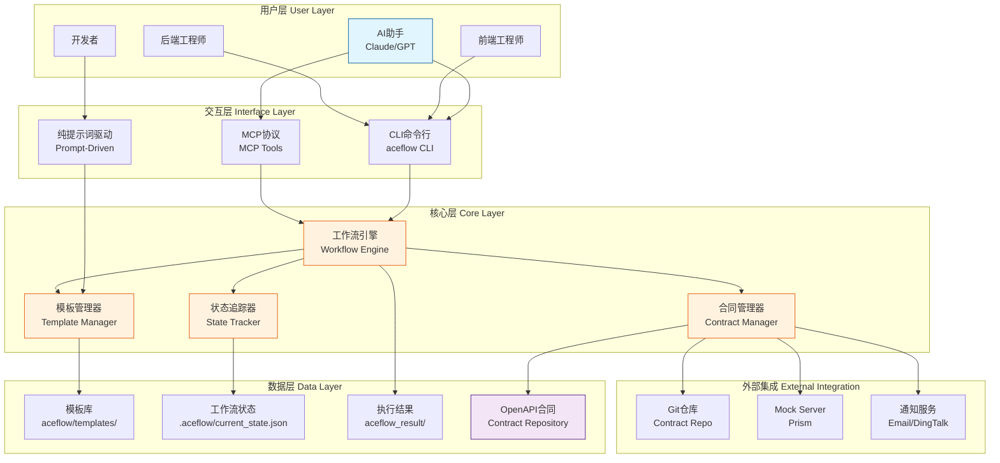
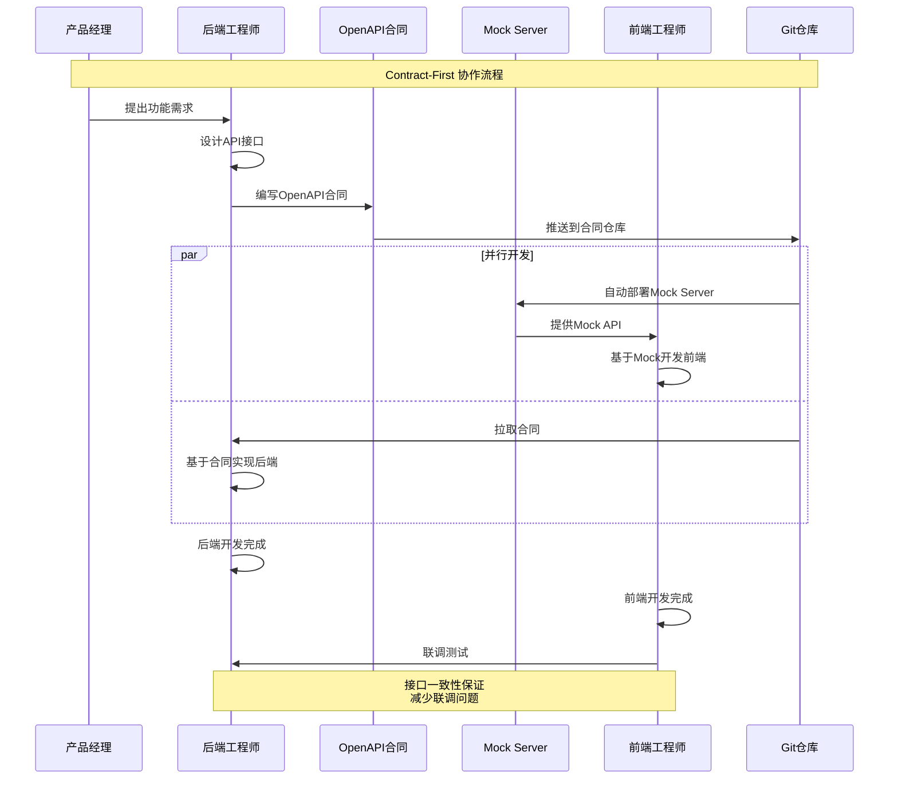
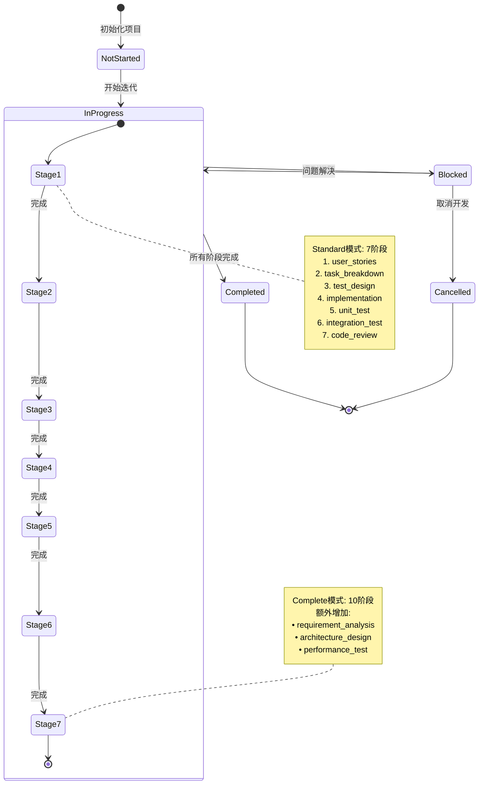

# AceFlow - AI驱动的Contract-First软件开发工作流系统

<div align="center">

**让AI成为你的开发流程管理专家**

[](https://github.com/aceflow-pateoas/aceflow-ai)
[](https://www.python.org/)
[](LICENSE)
[](https://modelcontextprotocol.io)

</div>

---

## 🎯 What - AceFlow是什么？

**AceFlow** 是一个专为AI代理设计的**Contract-First软件开发工作流管理系统**。它将OpenAPI合同作为前后端协作的Single Source of Truth，通过标准化的模板和智能化的状态追踪，让AI助手能够高效地管理整个软件开发生命周期。

### 核心价值主张

```
┌─────────────────────────────────────────────────────────────────┐
│                                                                 │
│  传统开发流程  →  混乱、重复、低效                              │
│                                                                 │
│  AceFlow方案   →  标准化、智能化、高效                         │
│                                                                 │
│  • 前后端通过OpenAPI合同解耦                                    │
│  • AI基于模板自动生成文档                                       │
│  • 工作流状态自动追踪管理                                       │
│  • 支持纯提示词、CLI、MCP三种使用方式                           │
│                                                                 │
└─────────────────────────────────────────────────────────────────┘
```

### 一句话总结

> **AceFlow = Contract-First + AI-Driven + Workflow Automation**
>
> 让AI按照标准化流程管理你的软件开发，从需求分析到代码审查，全程可追溯。

---

## 🏗️ 系统架构

### 整体架构图



### Contract-First工作流架构



### 工作流状态机



### 技术栈架构

```
┏━━━━━━━━━━━━━━━━━━━━━━━━━━━━━━━━━━━━━━━━━━━━━━━━━━━━━━━━┓
┃                     AceFlow 技术栈                      ┃
┗━━━━━━━━━━━━━━━━━━━━━━━━━━━━━━━━━━━━━━━━━━━━━━━━━━━━━━━━┛

┌────────────────────────────────────────────────────────┐
│  前端集成 Frontend Integration                          │
├────────────────────────────────────────────────────────┤
│  • Claude Code (MCP)      • Cline (MCP)                │
│  • 任何支持MCP协议的AI工具                              │
└────────────────────────────────────────────────────────┘
                            ↓
┌────────────────────────────────────────────────────────┐
│  协议层 Protocol Layer                                  │
├────────────────────────────────────────────────────────┤
│  • MCP (Model Context Protocol)                        │
│  • JSON-RPC 2.0                                        │
│  • stdio/HTTP 传输                                     │
└────────────────────────────────────────────────────────┘
                            ↓
┌────────────────────────────────────────────────────────┐
│  核心引擎 Core Engine                                   │
├────────────────────────────────────────────────────────┤
│  • Python 3.8+           • Click (CLI)                 │
│  • Jinja2 (模板渲染)     • PyYAML (配置)               │
│  • Pydantic (数据验证)   • Rich (终端UI)               │
└────────────────────────────────────────────────────────┘
                            ↓
┌────────────────────────────────────────────────────────┐
│  外部工具 External Tools                                │
├────────────────────────────────────────────────────────┤
│  • Git (合同版本控制)    • Prism (Mock Server)         │
│  • SMTP (邮件通知)       • DingTalk (即时通知)         │
└────────────────────────────────────────────────────────┘
                            ↓
┌────────────────────────────────────────────────────────┐
│  存储层 Storage Layer                                   │
├────────────────────────────────────────────────────────┤
│  • 本地文件系统 (模板、配置、状态)                      │
│  • Git仓库 (OpenAPI合同、迭代文档)                     │
└────────────────────────────────────────────────────────┘
```

---

## 💡 Why - 为什么需要AceFlow？

### 传统开发流程的痛点

#### 1️⃣ 前后端协作混乱

```
传统流程:
后端: "我改了接口，你重新对接一下"
前端: "你改了什么？文档呢？"
后端: "文档？代码就是文档..."
前端: "😤"

AceFlow解决方案:
OpenAPI合同 → Git版本控制 → 自动通知
Mock Server → 前端独立开发 → 并行不阻塞
```

#### 2️⃣ AI使用不规范

```
传统AI辅助开发:
开发者: "帮我写用户故事"
AI: 写了100行...格式不统一，质量参差不齐
开发者: "再改一下格式..."
AI: 又写了150行...
开发者: "算了，我自己写吧 😓"

AceFlow解决方案:
AI读取标准模板 → 按表格填充内容 → 格式统一质量高
模板专为AI优化 → 简洁高效 → 一次到位
```

#### 3️⃣ 流程文档缺失

```
传统开发:
• 需求？在脑子里
• 设计？在白板上（已擦掉）
• 测试用例？代码里（也许）
• 代码审查？靠自觉

项目交接时: "这代码谁写的？为什么这么设计？😱"

AceFlow解决方案:
每个阶段自动生成文档 → 保存到 aceflow_result/
状态自动追踪 → 一目了然
项目交接时: 查看 aceflow_result/iter_001/ → 一切清晰 ✅
```

### AceFlow的核心优势

| 对比维度 | 传统方式 | AceFlow方式 |
|---------|---------|------------|
| **前后端协作** | 口头沟通、文档过时 | OpenAPI合同、版本控制 |
| **开发流程** | 靠经验、不统一 | 标准化模板、AI驱动 |
| **文档管理** | 手动维护、经常缺失 | 自动生成、强制输出 |
| **进度追踪** | 人工询问、信息滞后 | 自动追踪、实时状态 |
| **AI辅助** | 随意对话、质量不稳定 | 模板驱动、质量保证 |
| **团队协作** | 各自为战、标准不一 | 统一流程、可复制 |

### 适用场景

#### ✅ 推荐使用AceFlow的场景

- **前后端分离项目**: 通过OpenAPI合同实现完美解耦
- **AI深度参与开发**: 利用标准化模板提升AI输出质量
- **团队协作项目**: 需要统一开发流程和文档标准
- **需要流程追溯**: 需要保留完整的开发过程文档
- **敏捷迭代开发**: 快速推进多个迭代，每个迭代都有清晰记录

#### ⚠️ 不太适合的场景

- **一次性脚本**: 简单脚本无需复杂流程
- **纯后端微服务**: 如果没有前后端协作需求，可只使用工作流部分
- **原型验证阶段**: 快速验证想法时可先跳过

---

## 🚀 How - 如何使用AceFlow？

### 三种使用方式

AceFlow支持从简单到高级的三种使用方式，满足不同用户需求：

```
┌─────────────────────────────────────────────────────────────┐
│                     使用方式选择                             │
├─────────────────────────────────────────────────────────────┤
│                                                             │
│  1️⃣  纯提示词驱动 (Prompt-Driven)                           │
│      • 适合: 新手、快速体验                                  │
│      • 工具: 无需安装任何工具                                │
│      • 方式: 复制模板 + AI对话                              │
│      • 自动化: ⭐☆☆☆☆ (手动操作)                           │
│                                                             │
│  2️⃣  CLI命令行辅助 (CLI-Assisted)                          │
│      • 适合: 熟练开发者、需要命令行工具                      │
│      • 工具: pip install aceflow-mcp-server                │
│      • 方式: aceflow命令 + AI对话                          │
│      • 自动化: ⭐⭐⭐☆☆ (半自动)                            │
│                                                             │
│  3️⃣  MCP深度集成 (MCP Integration)                         │
│      • 适合: 高级用户、追求全自动化                          │
│      • 工具: Claude Code / Cline + MCP配置                 │
│      • 方式: AI自动调用MCP工具                              │
│      • 自动化: ⭐⭐⭐⭐⭐ (全自动)                           │
│                                                             │
└─────────────────────────────────────────────────────────────┘
```

### Quick Start - 5分钟上手

#### 方式1️⃣: 纯提示词驱动（零安装）

```bash
# Step 1: 复制demo到你的项目
cp -r aceflow-ai/demo/.aceflow your-project/

# Step 2: 创建结果目录
cd your-project
mkdir -p aceflow_result/iter_001/standard

# Step 3: 与AI对话
# "请基于 .aceflow/templates/standard/user_stories.md 模板，
#  为'用户登录'功能生成用户故事"
```

**优点**:
- ✅ 零安装，立即上手
- ✅ 完全控制每一步
- ✅ 适合学习理解流程

**缺点**:
- ❌ 手动操作多
- ❌ 无状态追踪
- ❌ 需要记住模板路径

---

#### 方式2️⃣: CLI命令行辅助（推荐）

```bash
# Step 1: 安装AceFlow
pip install aceflow-mcp-server

# Step 2: 初始化项目
cd your-project
aceflow init
# 按提示输入项目信息（可选）

# Step 3: 导出模板到项目
aceflow export templates
# 自动创建 .aceflow/templates/

# Step 4: Contract-First工作流（可选）
aceflow contract generate --feature user-login
aceflow contract push --feature user-login
aceflow mock start --feature user-login
# 前端可以访问 http://localhost:4010 进行开发

# Step 5: 与AI对话推进工作流
# AI可以读取模板生成文档
```

**优点**:
- ✅ 工具辅助，效率更高
- ✅ 支持Contract-First工作流
- ✅ Mock Server开箱即用

**缺点**:
- ❌ 需要安装Python包
- ❌ 仍需手动与AI对话
- ❌ 状态追踪需手动维护

---

#### 方式3️⃣: MCP深度集成（专家模式）

```bash
# Step 1: 安装AceFlow
pip install aceflow-mcp-server

# Step 2: 配置Claude Code的MCP设置
# 编辑 ~/.config/claude-code/mcp_settings.json
{
  "mcpServers": {
    "aceflow": {
      "command": "python3",
      "args": ["-m", "aceflow_mcp_server.mcp_http_server"],
      "env": {
        "ACEFLOW_PORT": "18000"
      }
    }
  }
}

# Step 3: 重启Claude Code
# MCP Server自动启动

# Step 4: 在项目中与AI对话
# "帮我初始化一个AceFlow工作流，使用Standard模式"
# AI自动调用: aceflow_init_workflow
# AI自动生成: .aceflow/config.yaml, current_state.json

# "生成用户故事文档"
# AI自动调用: aceflow_generate_stage_document
# AI自动生成: aceflow_result/iter_001/standard/user_stories.md

# "查看当前进度"
# AI自动调用: aceflow_get_current_status
# AI自动返回: 当前阶段、完成度、下一步建议
```

**优点**:
- ✅ 全自动化，AI完全接管
- ✅ 状态自动追踪
- ✅ 智能推荐下一步
- ✅ 最佳开发体验

**缺点**:
- ❌ 配置相对复杂
- ❌ 需要支持MCP的AI工具
- ❌ 学习曲线稍陡

---

### 工作流模式选择

#### Standard模式 vs Complete模式

```
┌──────────────────────────────────────────────────────────────┐
│                        工作流模式对比                          │
├──────────────────────────────────────────────────────────────┤
│                                                              │
│  📦 Standard模式 (7阶段)                                     │
│  ├─ 适用场景: 日常功能开发、Bug修复、小型项目                 │
│  ├─ 团队规模: 3-10人                                         │
│  ├─ 开发周期: 5-10天                                         │
│  └─ 阶段列表:                                                │
│      1. user_stories      - 用户故事                         │
│      2. task_breakdown    - 任务分解                         │
│      3. test_design       - 测试设计                         │
│      4. implementation    - 功能实现                         │
│      5. unit_test         - 单元测试                         │
│      6. integration_test  - 集成测试                         │
│      7. code_review       - 代码审查                         │
│                                                              │
│  🏢 Complete模式 (10阶段)                                    │
│  ├─ 适用场景: 大型项目、关键系统、需要详细设计                 │
│  ├─ 团队规模: 10+人                                          │
│  ├─ 开发周期: 2-4周                                          │
│  └─ 阶段列表:                                                │
│      1. requirement_analysis  - 需求分析     ⭐ 新增         │
│      2. architecture_design   - 架构设计     ⭐ 新增         │
│      3. user_stories          - 用户故事                     │
│      4. task_breakdown        - 任务分解                     │
│      5. test_design           - 测试设计                     │
│      6. implementation        - 功能实现                     │
│      7. unit_test             - 单元测试                     │
│      8. integration_test      - 集成测试                     │
│      9. performance_test      - 性能测试     ⭐ 新增         │
│      10. code_review          - 代码审查                     │
│                                                              │
└──────────────────────────────────────────────────────────────┘
```

**选择建议**:

| 项目特征 | 推荐模式 | 原因 |
|---------|---------|------|
| 新功能开发（2周内） | Standard | 快速迭代，避免过度设计 |
| 核心系统重构 | Complete | 需要详细需求和架构设计 |
| Bug修复 | Standard | 无需完整流程 |
| 大型项目启动 | Complete | 前期投入回报高 |
| 团队新成员多 | Complete | 详细文档帮助理解 |
| 快速MVP验证 | Standard | 减少文档开销 |

---

### 实际使用流程示例

#### 完整开发流程演示（Standard模式）

```
┏━━━━━━━━━━━━━━━━━━━━━━━━━━━━━━━━━━━━━━━━━━━━━━━━━━━━━━━━┓
┃  场景: 开发"用户登录"功能                                 ┃
┃  模式: Standard (7阶段)                                  ┃
┃  周期: 5天                                               ┃
┗━━━━━━━━━━━━━━━━━━━━━━━━━━━━━━━━━━━━━━━━━━━━━━━━━━━━━━━━┛

📅 Day 1: 需求和设计
┌────────────────────────────────────────────────────────┐
│ [Stage 1] user_stories - 用户故事                       │
├────────────────────────────────────────────────────────┤
│ User: "开始用户登录功能开发，使用Standard模式"           │
│ AI:   [调用 aceflow_init_workflow]                     │
│       ✅ 初始化工作流配置                                │
│       ✅ 创建迭代目录 iter_20250113_001                 │
│                                                        │
│ User: "生成用户故事"                                    │
│ AI:   [读取模板 .aceflow/templates/standard/            │
│        user_stories.md]                                │
│       [调用 aceflow_generate_stage_document]           │
│       ✅ 生成 aceflow_result/iter_20250113_001/         │
│          standard/user_stories.md                      │
│                                                        │
│ 输出内容:                                               │
│   • US-001: 用户名密码登录                              │
│   • US-002: 记住登录状态                                │
│   • US-003: 登录失败提示                                │
└────────────────────────────────────────────────────────┘

┌────────────────────────────────────────────────────────┐
│ [Stage 2] task_breakdown - 任务分解                     │
├────────────────────────────────────────────────────────┤
│ User: "基于用户故事，生成任务分解"                       │
│ AI:   [读取 user_stories.md]                           │
│       [读取模板 task_breakdown.md]                      │
│       [调用 aceflow_generate_stage_document]           │
│       ✅ 生成任务分解文档                                │
│                                                        │
│ 输出内容:                                               │
│   • 后端: 实现登录API (4h)                              │
│   • 后端: JWT认证中间件 (3h)                            │
│   • 前端: 登录页面UI (5h)                               │
│   • 前端: 登录状态管理 (3h)                             │
│   • 测试: 编写测试用例 (4h)                             │
│   总计: 19小时 / 3个工作日                              │
└────────────────────────────────────────────────────────┘

📅 Day 2: Contract-First协作
┌────────────────────────────────────────────────────────┐
│ [Contract] 生成和推送OpenAPI合同                        │
├────────────────────────────────────────────────────────┤
│ User: "生成登录功能的OpenAPI合同"                        │
│ AI:   [基于用户故事和任务分解生成OpenAPI]                │
│       POST /api/auth/login                             │
│       POST /api/auth/logout                            │
│       GET  /api/auth/me                                │
│       [调用 aceflow_contract_push]                     │
│       ✅ 推送到Git合同仓库                               │
│                                                        │
│ User: "启动Mock Server"                                │
│ AI:   [调用 aceflow_mock_start]                        │
│       ✅ Mock Server运行在 http://localhost:4010       │
│                                                        │
│ 前端和后端可以并行开发了! 🎉                             │
└────────────────────────────────────────────────────────┘

📅 Day 3: 测试和实现
┌────────────────────────────────────────────────────────┐
│ [Stage 3] test_design - 测试设计                        │
├────────────────────────────────────────────────────────┤
│ User: "生成测试设计文档"                                 │
│ AI:   [读取用户故事和任务分解]                           │
│       [生成测试用例]                                     │
│       ✅ 单元测试: 15个用例                              │
│       ✅ 集成测试: 8个场景                               │
│       ✅ 边界测试: 密码错误、账号锁定等                   │
└────────────────────────────────────────────────────────┘

┌────────────────────────────────────────────────────────┐
│ [Stage 4] implementation - 功能实现                     │
├────────────────────────────────────────────────────────┤
│ User: "开始实现登录功能"                                 │
│ AI:   [基于任务分解和OpenAPI合同]                       │
│       [生成代码框架]                                     │
│       ✅ 后端: FastAPI路由和认证逻辑                     │
│       ✅ 前端: React登录组件                            │
│       ✅ 数据库: User表结构                             │
│                                                        │
│ User: "更新实现状态"                                    │
│ AI:   [调用 aceflow_update_stage_status]               │
│       ✅ implementation: completed                     │
└────────────────────────────────────────────────────────┘

📅 Day 4: 测试阶段
┌────────────────────────────────────────────────────────┐
│ [Stage 5] unit_test - 单元测试                          │
├────────────────────────────────────────────────────────┤
│ User: "运行单元测试"                                    │
│ AI:   [执行测试命令]                                     │
│       pytest tests/unit/                               │
│       ✅ 15/15 passed                                  │
│       ✅ Coverage: 87%                                 │
│       [生成测试报告文档]                                 │
└────────────────────────────────────────────────────────┘

┌────────────────────────────────────────────────────────┐
│ [Stage 6] integration_test - 集成测试                   │
├────────────────────────────────────────────────────────┤
│ User: "运行集成测试"                                    │
│ AI:   [执行集成测试]                                     │
│       pytest tests/integration/                        │
│       ✅ 8/8 scenarios passed                          │
│       ✅ 前后端联调成功                                  │
│       [生成集成测试报告]                                 │
└────────────────────────────────────────────────────────┘

📅 Day 5: 代码审查和发布
┌────────────────────────────────────────────────────────┐
│ [Stage 7] code_review - 代码审查                        │
├────────────────────────────────────────────────────────┤
│ User: "进行代码审查"                                    │
│ AI:   [分析代码质量]                                     │
│       ✅ 代码规范: 9/10                                 │
│       ✅ 安全检查: 通过                                  │
│       ✅ 性能分析: 良好                                  │
│       ⚠️  建议: 添加登录失败限流                         │
│       [生成代码审查报告]                                 │
│                                                        │
│ User: "完成工作流"                                      │
│ AI:   [调用 aceflow_complete_workflow]                 │
│       ✅ 工作流状态: completed                          │
│       ✅ 所有文档已生成在 aceflow_result/iter_...       │
└────────────────────────────────────────────────────────┘

🎉 完成! 整个流程产出:
├─ aceflow_result/iter_20250113_001/standard/
│   ├─ user_stories.md        (用户故事)
│   ├─ task_breakdown.md      (任务分解)
│   ├─ test_design.md         (测试设计)
│   ├─ implementation.md      (实现说明)
│   ├─ unit_test.md           (单元测试报告)
│   ├─ integration_test.md    (集成测试报告)
│   └─ code_review.md         (代码审查报告)
├─ src/
│   ├─ backend/auth/          (后端实现)
│   └─ frontend/login/        (前端实现)
└─ contract/
    └─ user_login_openapi.yaml (OpenAPI合同)
```

---

## 📦 目录结构

### 项目集成后的目录结构

```
your-project/                              # 你的项目根目录
├── .aceflow/                              # AceFlow配置目录
│   ├── config.yaml                        # 项目配置
│   │   ├─ project_name                    # 项目名称
│   │   ├─ features                        # 功能开关
│   │   └─ contract_repo                   # 合同仓库配置
│   │
│   ├── current_state.json                 # 工作流状态
│   │   ├─ current_iteration_id            # 当前迭代ID
│   │   ├─ workflow_mode                   # 工作流模式
│   │   ├─ current_stage                   # 当前阶段
│   │   └─ completed_stages                # 已完成阶段
│   │
│   └── templates/                         # 模板库
│       ├── SPEC.md                        # AceFlow规范
│       ├── README.md                      # 模板说明
│       ├── USAGE.md                       # 使用指南
│       ├── standard/                      # Standard模式模板
│       │   ├── user_stories.md
│       │   ├── task_breakdown.md
│       │   ├── test_design.md
│       │   ├── implementation.md
│       │   ├── unit_test.md
│       │   ├── integration_test.md
│       │   └── code_review.md
│       └── complete/                      # Complete模式模板
│           ├── requirement_analysis.md
│           ├── architecture_design.md
│           ├── user_stories.md
│           ├── task_breakdown.md
│           ├── test_design.md
│           ├── implementation.md
│           ├── unit_test.md
│           ├── integration_test.md
│           ├── performance_test.md
│           └── code_review.md
│
├── aceflow_result/                        # 工作流执行结果
│   ├── iter_20250113_001/                 # 第一次迭代
│   │   ├── standard/                      # 使用Standard模式
│   │   │   ├── user_stories.md            # AI生成的用户故事
│   │   │   ├── task_breakdown.md          # AI生成的任务分解
│   │   │   └── ...
│   │   └── contract/                      # 合同文件
│   │       └── user_login_openapi.yaml
│   │
│   └── iter_20250115_002/                 # 第二次迭代
│       ├── complete/                      # 使用Complete模式
│       │   ├── requirement_analysis.md
│       │   └── ...
│       └── contract/
│           └── payment_openapi.yaml
│
├── src/                                   # 项目源码
│   ├── backend/                           # 后端代码
│   └── frontend/                          # 前端代码
│
├── tests/                                 # 测试代码
│   ├── unit/                              # 单元测试
│   └── integration/                       # 集成测试
│
├── README.md                              # 项目文档
└── .gitignore                             # Git忽略配置
    # 建议配置:
    # .aceflow/current_state.json          # 不提交运行时状态
    # !.aceflow/config.yaml                # 提交配置
    # !.aceflow/templates/                 # 提交模板
    # aceflow_result/                      # 可选提交作为项目文档
```

---

## 🛠️ MCP工具清单

AceFlow提供以下MCP工具供AI调用：

### 工作流管理

| 工具名称 | 功能描述 | 参数 |
|---------|---------|------|
| `aceflow_init_workflow` | 初始化工作流 | mode, feature_name, iteration_id |
| `aceflow_get_current_status` | 获取当前状态 | - |
| `aceflow_advance_to_next_stage` | 推进到下一阶段 | - |
| `aceflow_update_stage_status` | 更新阶段状态 | stage_id, status |
| `aceflow_complete_workflow` | 完成工作流 | - |

### 文档生成

| 工具名称 | 功能描述 | 参数 |
|---------|---------|------|
| `aceflow_generate_stage_document` | 生成阶段文档 | stage_id, content |
| `aceflow_read_template` | 读取模板 | stage_id |
| `aceflow_list_templates` | 列出所有模板 | mode |

### 合同管理

| 工具名称 | 功能描述 | 参数 |
|---------|---------|------|
| `aceflow_contract_generate` | 生成OpenAPI合同 | feature, content |
| `aceflow_contract_push` | 推送合同到Git | feature, message |
| `aceflow_mock_start` | 启动Mock Server | feature, port |
| `aceflow_mock_stop` | 停止Mock Server | port |
| `aceflow_mock_list` | 列出运行中的Mock | - |

---

## 📚 资源链接

### 官方资源

- **GitHub仓库**: [https://github.com/aceflow-pateoas/aceflow-ai](https://github.com/aceflow-pateoas/aceflow-ai)
- **PyPI包**: [https://pypi.org/project/aceflow-mcp-server/](https://pypi.org/project/aceflow-mcp-server/)
- **完整文档**: 查看项目中的 `aceflow/templates/SPEC.md`

### 快速导航

- **模板库说明**: `.aceflow/templates/README.md`
- **使用指南**: `.aceflow/templates/USAGE.md`
- **Demo示例**: `demo/` 目录
- **MCP配置指南**: `docs/CLINE_MCP_INTEGRATION_GUIDE.md`

### 社区和支持

- **问题反馈**: [GitHub Issues](https://github.com/aceflow-pateoas/aceflow-ai/issues)
- **功能建议**: [GitHub Discussions](https://github.com/aceflow-pateoas/aceflow-ai/discussions)

---

## 🎓 最佳实践

### 1. Git配置建议

```gitignore
# .gitignore

# AceFlow运行时状态（不提交）
.aceflow/current_state.json
.aceflow/mock/*.pid

# 保留配置和模板（提交到Git）
!.aceflow/config.yaml
!.aceflow/templates/

# 执行结果（可选提交作为项目文档）
# aceflow_result/

# 如果提交 aceflow_result/，建议忽略临时文件
aceflow_result/**/*.tmp
aceflow_result/**/*.bak
```

### 2. 团队协作建议

#### 统一团队标准
```bash
# 1. 项目负责人初始化
aceflow init
aceflow export templates

# 2. 提交到Git
git add .aceflow/config.yaml .aceflow/templates/
git commit -m "chore: add AceFlow configuration"

# 3. 团队成员拉取
git pull
pip install aceflow-mcp-server
```

#### 迭代命名规范
```
推荐格式: iter_YYYYMMDD_NNN
示例:
  iter_20250113_001  - 2025年1月13日第1次迭代
  iter_20250113_002  - 2025年1月13日第2次迭代
  iter_20250120_001  - 2025年1月20日第1次迭代
```

### 3. 模板自定义

模板文件可以根据团队需求自定义：

```bash
# 编辑模板
vim .aceflow/templates/standard/user_stories.md

# 添加团队特定的检查项、格式要求
# 例如：添加"安全审查"检查项

# 提交到Git，团队共享
git add .aceflow/templates/
git commit -m "chore: customize user_stories template"
```

### 4. CI/CD集成

```yaml
# .github/workflows/aceflow-check.yml
name: AceFlow Documentation Check

on: [pull_request]

jobs:
  check-docs:
    runs-on: ubuntu-latest
    steps:
      - uses: actions/checkout@v2

      - name: Check AceFlow documents
        run: |
          # 检查当前迭代是否有必要的文档
          if [ -d "aceflow_result/$ITERATION_ID" ]; then
            echo "✅ AceFlow文档存在"
          else
            echo "❌ 缺少AceFlow文档"
            exit 1
          fi
```

---

## ❓ 常见问题

### Q1: 为什么使用隐藏目录 `.aceflow/`？

**A**: 保持项目根目录整洁，避免模板文件干扰项目结构。使用 `ls -la` 可以查看隐藏目录。

### Q2: 可以不使用MCP吗？

**A**: 完全可以！AceFlow支持三种使用方式：
- 纯提示词驱动（无需任何工具）
- CLI辅助（只需安装Python包）
- MCP集成（全自动化）

选择最适合你的方式即可。

### Q3: `aceflow_result/` 目录需要提交到Git吗？

**A**: 这是可选的：
- ✅ **提交**: 保留完整的开发过程文档，便于回顾和交接
- ❌ **不提交**: 减少Git仓库大小，文档可以重新生成

建议至少在项目交接时提交最终版本。

### Q4: 如何更新模板？

**A**:
```bash
# 重新导出模板
aceflow export templates

# 会覆盖 .aceflow/templates/ 目录
# 如果有自定义修改，建议先备份
```

### Q5: Standard和Complete模式可以混用吗？

**A**: 不建议在同一个迭代中混用。但可以：
- 迭代1使用Standard模式
- 迭代2使用Complete模式
- 根据功能复杂度选择合适的模式

### Q6: Mock Server需要安装什么依赖？

**A**:
```bash
# 需要安装Prism CLI
npm install -g @stoplight/prism-cli

# 或使用Docker
docker pull stoplight/prism:latest
```

### Q7: 支持哪些AI工具？

**A**:
- ✅ **Claude Code** (官方推荐，MCP原生支持)
- ✅ **Cline** (VS Code插件，MCP支持)
- ✅ **任何支持对话的AI** (通过纯提示词驱动)
- 🔄 **其他MCP兼容工具** (持续增加中)

### Q8: 如何处理多人协作冲突？

**A**:
1. **状态文件冲突**: `.aceflow/current_state.json` 不提交到Git
2. **文档冲突**: `aceflow_result/` 按迭代隔离，减少冲突
3. **合同冲突**: 使用Git合同仓库的分支策略

---

## 🚦 下一步

### 立即开始

```bash
# 选择你的方式

# 🚀 方式1: 快速体验（零安装）
cp -r aceflow-ai/demo/.aceflow your-project/

# 🔧 方式2: 安装完整工具
pip install aceflow-mcp-server
cd your-project && aceflow init

# ⚡ 方式3: MCP深度集成
pip install aceflow-mcp-server
# 配置Claude Code MCP设置
```

### 推荐学习路径

```
1️⃣ 阅读本文档 (15分钟)
    ↓
2️⃣ 查看Demo示例 (10分钟)
    - 查看 demo/aceflow_result/iter_001/standard/user_stories.md
    - 理解AI生成文档的格式
    ↓
3️⃣ 选择使用方式 (5分钟)
    - 新手: 纯提示词驱动
    - 熟练: CLI命令行
    - 专家: MCP集成
    ↓
4️⃣ 实际项目试用 (30分钟)
    - 选择一个小功能
    - 使用Standard模式
    - 完成一个完整迭代
    ↓
5️⃣ 深入学习 (按需)
    - 阅读 SPEC.md 了解详细规范
    - 自定义模板适应团队需求
    - 配置Contract-First工作流
```

---

<div align="center">

**🎉 欢迎使用AceFlow！**

让AI成为你的开发流程管理专家

[快速开始](#-how---如何使用aceflow) • [查看Demo](demo/) • [完整文档](aceflow/templates/SPEC.md)

</div>
