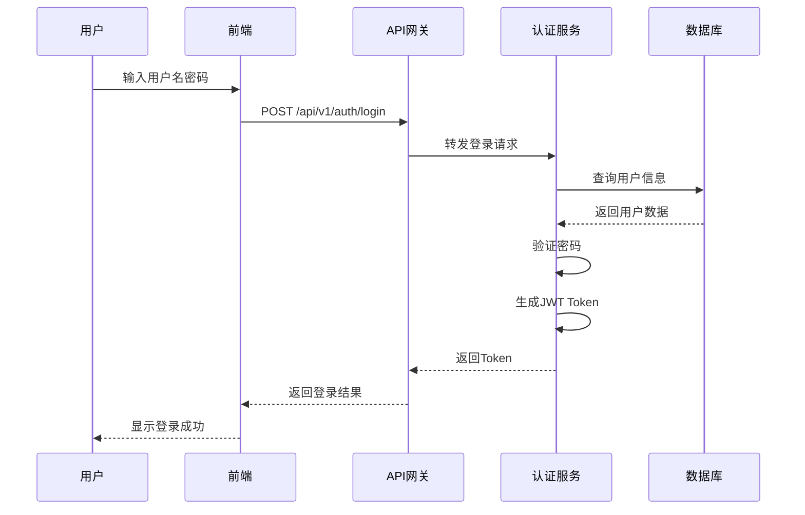

# P2阶段: 技术设计

**迭代ID**: `{iteration_id}`
**阶段**: P2 - 技术设计
**开始时间**: `{start_time}`
**负责人**: `{owner}`

---

## 1. 系统架构设计

### 1.1 总体架构

```
┌─────────────────────────────────────────────────────┐
│                    前端层 (Frontend)                 │
│  ┌──────────┐  ┌──────────┐  ┌──────────┐          │
│  │  Web应用  │  │ 移动应用  │  │  管理后台 │          │
│  └──────────┘  └──────────┘  └──────────┘          │
└─────────────────────────────────────────────────────┘
                        ↓ HTTP/HTTPS
┌─────────────────────────────────────────────────────┐
│                  应用层 (Application)                │
│  ┌──────────┐  ┌──────────┐  ┌──────────┐          │
│  │ API网关   │  │ 业务服务  │  │ 认证服务  │          │
│  └──────────┘  └──────────┘  └──────────┘          │
└─────────────────────────────────────────────────────┘
                        ↓
┌─────────────────────────────────────────────────────┐
│                   数据层 (Data)                      │
│  ┌──────────┐  ┌──────────┐  ┌──────────┐          │
│  │  数据库   │  │   缓存    │  │  文件存储 │          │
│  └──────────┘  └──────────┘  └──────────┘          │
└─────────────────────────────────────────────────────┘
```

### 1.2 架构说明
<!-- 描述架构的核心思想和设计原则 -->

- **分层设计**:
- **解耦原则**:
- **扩展性**:

### 1.3 技术选型

| 层次 | 组件 | 技术选择 | 版本 | 选型理由 |
|-----|------|---------|------|---------|
| 前端 | Web框架 |  |  |  |
| 后端 | API框架 |  |  |  |
| 数据库 | 关系型DB |  |  |  |
| 缓存 | 缓存系统 |  |  |  |
| 部署 | 容器化 |  |  |  |

---

## 2. 模块设计

### 2.1 模块划分

```
项目名称/
├── 模块A: {模块名称}
│   ├── 功能1
│   ├── 功能2
│   └── 功能3
├── 模块B: {模块名称}
│   ├── 功能1
│   └── 功能2
└── 模块C: {模块名称}
    ├── 功能1
    └── 功能2
```

### 2.2 模块职责

#### 模块A: {模块名称}
**职责**:
**核心功能**:
- 功能1描述
- 功能2描述

**对外接口**:
- 接口1:
- 接口2:

**依赖关系**:
- 依赖模块B
- 依赖模块C

---

## 3. API接口设计

### 3.1 API规范

- **协议**: RESTful API / GraphQL
- **认证方式**: JWT / OAuth2.0
- **数据格式**: JSON
- **版本控制**: URL版本号 (v1, v2)

### 3.2 API列表

| API编号 | HTTP方法 | 端点 | 功能描述 | 负责模块 |
|--------|----------|------|---------|---------|
| API-001 | GET | /api/v1/users | 获取用户列表 | 用户模块 |
| API-002 | POST | /api/v1/users | 创建用户 | 用户模块 |
| API-003 | PUT | /api/v1/users/:id | 更新用户 | 用户模块 |
| API-004 | DELETE | /api/v1/users/:id | 删除用户 | 用户模块 |

### 3.3 API详细设计

#### API-001: 获取用户列表

**基本信息**:
- 方法: `GET`
- 路径: `/api/v1/users`
- 描述: 获取系统用户列表,支持分页和筛选

**请求参数**:
| 参数名 | 类型 | 必填 | 说明 | 示例 |
|-------|------|------|------|------|
| page | int | 否 | 页码(默认1) | 1 |
| size | int | 否 | 每页大小(默认20) | 20 |
| keyword | string | 否 | 搜索关键词 | "张三" |
| status | string | 否 | 用户状态 | "active" |

**请求示例**:
```bash
curl -X GET "https://api.example.com/api/v1/users?page=1&size=20" \
  -H "Authorization: Bearer {token}"
```

**响应格式**:
```json
{
  "code": 200,
  "message": "success",
  "data": {
    "total": 100,
    "page": 1,
    "size": 20,
    "items": [
      {
        "id": 1,
        "username": "zhangsan",
        "email": "zhangsan@example.com",
        "status": "active",
        "created_at": "2025-11-01T10:00:00Z"
      }
    ]
  }
}
```

**错误码**:
| 错误码 | 说明 | HTTP状态码 |
|-------|------|-----------|
| 40001 | 未授权访问 | 401 |
| 40003 | 无权限 | 403 |
| 50001 | 服务器内部错误 | 500 |

---

## 4. 数据库设计

### 4.1 ER图

```
┌─────────────┐         ┌─────────────┐         ┌─────────────┐
│   Users     │────────▶│   Orders    │────────▶│ OrderItems  │
│             │ 1     n │             │ 1     n │             │
└─────────────┘         └─────────────┘         └─────────────┘
```

### 4.2 数据表设计

#### 表1: users (用户表)

| 字段名 | 类型 | 长度 | 可空 | 默认值 | 说明 | 索引 |
|-------|------|------|------|--------|------|------|
| id | BIGINT |  | N |  | 主键ID | PRIMARY |
| username | VARCHAR | 50 | N |  | 用户名 | UNIQUE |
| email | VARCHAR | 100 | N |  | 邮箱地址 | INDEX |
| password | VARCHAR | 255 | N |  | 密码(加密) |  |
| status | VARCHAR | 20 | N | 'active' | 状态 | INDEX |
| created_at | DATETIME |  | N | CURRENT_TIMESTAMP | 创建时间 |  |
| updated_at | DATETIME |  | N | CURRENT_TIMESTAMP | 更新时间 |  |

**索引设计**:
- PRIMARY KEY: `id`
- UNIQUE KEY: `idx_username` (`username`)
- INDEX: `idx_email` (`email`)
- INDEX: `idx_status_created` (`status`, `created_at`)

**约束说明**:
- `username`: 长度3-50字符,只能包含字母、数字、下划线
- `email`: 必须是有效的邮箱格式
- `password`: BCrypt加密,原始密码8-20字符

---

## 5. 数据流设计

### 5.1 核心业务流程

#### 用户登录流程



### 5.2 数据流说明
<!-- 描述核心业务流程的数据流转 -->

---

## 6. 缓存设计

### 6.1 缓存策略

| 数据类型 | 缓存方式 | 过期时间 | 更新策略 | 说明 |
|---------|---------|---------|---------|------|
| 用户信息 | Redis | 1小时 | 被动失效 | 用户登录后缓存 |
| 配置信息 | Redis | 24小时 | 主动更新 | 系统配置项 |
| 热点数据 | Redis | 5分钟 | LRU淘汰 | 访问频繁的数据 |

### 6.2 缓存Key设计

```
格式: {业务模块}:{数据类型}:{唯一标识}

示例:
- user:info:1001          # 用户ID为1001的信息
- config:system:app_name  # 系统配置
- cache:hot:product_list  # 热点商品列表
```

---

## 7. 安全设计

### 7.1 认证授权

**认证方式**:
- JWT Token认证
- Token有效期: 2小时
- Refresh Token有效期: 7天

**权限控制**:
- RBAC(基于角色的访问控制)
- 角色: 管理员、普通用户、访客
- 权限粒度: 接口级别

### 7.2 数据安全

**敏感数据加密**:
- 密码: BCrypt加密
- 个人信息: AES-256加密存储
- 传输: HTTPS/TLS 1.3

**防护措施**:
- SQL注入防护: 参数化查询
- XSS防护: 输入过滤和输出转义
- CSRF防护: Token验证
- 接口限流: 每用户每分钟100次

---

## 8. 性能设计

### 8.1 性能指标

| 指标 | 目标值 | 监控方式 |
|------|--------|---------|
| API响应时间 | P95 < 200ms | APM工具 |
| 数据库查询 | P99 < 100ms | 慢查询日志 |
| 页面加载时间 | < 2秒 | 前端监控 |
| 并发支持 | 1000 QPS | 压力测试 |

### 8.2 性能优化

**前端优化**:
- 静态资源CDN加速
- 图片懒加载
- 代码分包和按需加载

**后端优化**:
- 数据库索引优化
- SQL查询优化
- 接口响应缓存
- 数据库连接池

---

## 9. 部署架构

### 9.1 部署拓扑

```
                  ┌─────────────┐
                  │  负载均衡器  │
                  └─────────────┘
                        │
       ┌────────────────┼────────────────┐
       │                │                │
┌─────────────┐  ┌─────────────┐  ┌─────────────┐
│  Web服务器1  │  │  Web服务器2  │  │  Web服务器3  │
└─────────────┘  └─────────────┘  └─────────────┘
       │                │                │
       └────────────────┼────────────────┘
                        │
                 ┌─────────────┐
                 │   数据库集群 │
                 │ (主从复制)  │
                 └─────────────┘
```

### 9.2 环境规划

| 环境 | 用途 | 配置 | 数量 |
|-----|------|------|------|
| 开发环境 | 日常开发 | 2C4G | 1台 |
| 测试环境 | 功能测试 | 2C8G | 2台 |
| 预发环境 | 上线验证 | 4C16G | 2台 |
| 生产环境 | 正式运行 | 8C32G | 3台 |

---

## 10. 技术风险

### 10.1 风险清单

| 风险ID | 风险描述 | 可能性 | 影响度 | 应对方案 | 负责人 |
|-------|---------|--------|--------|---------|--------|
| T001 | 第三方API不稳定 | 中 | 高 | 实现降级方案 |  |
| T002 | 数据库性能瓶颈 | 低 | 高 | 读写分离+缓存 |  |
| T003 | 技术栈学习曲线 | 高 | 中 | 提前培训 |  |

---

## 11. 下一步计划

### 11.1 设计评审
- [ ] 架构评审通过
- [ ] API评审通过
- [ ] 数据库设计评审通过
- [ ] 安全评审通过

### 11.2 下阶段安排
- **下阶段**: D1 - 功能开发
- **预计开始时间**: `{next_stage_time}`
- **输出要求**: 功能代码实现、单元测试、开发文档

---

## 附件

### 附件清单
- [ ] 架构设计图
- [ ] API文档(Swagger/OpenAPI)
- [ ] 数据库建表SQL
- [ ] 部署脚本

---

**完成时间**: `{completion_time}`
**审核人**: `{reviewer}`
**审核状态**: ✅ 通过 / ❌ 待修改
