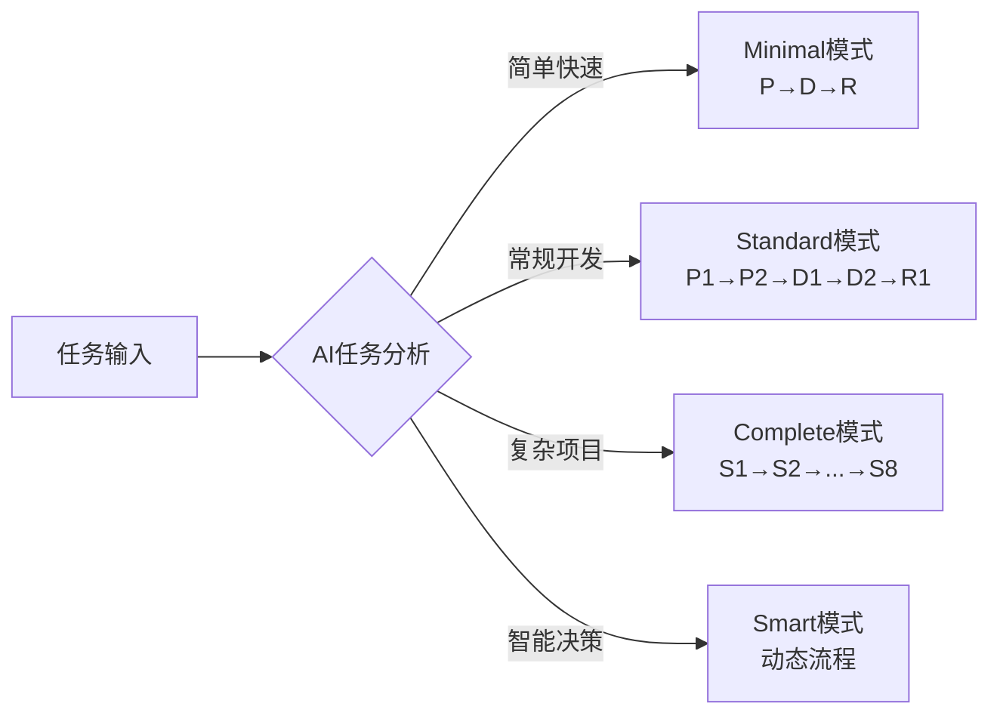

# AceFlow v3.0 完整规范文档

> **版本**: v3.0.0
> **更新时间**: 2025-11-06
> **类型**: AI驱动的软件开发工作流管理系统
> **适用范围**: 1-20+人团队的软件项目

---

## 📋 目录

1. [概述](#1-概述)
2. [核心原则](#2-核心原则)
3. [流程模式](#3-流程模式)
4. [阶段定义](#4-阶段定义)
5. [目录结构](#5-目录结构)
6. [配置说明](#6-配置说明)
7. [使用指南](#7-使用指南)

---

## 1. 概述

### 1.1 AceFlow 是什么?

AceFlow 是一个 **AI驱动的软件开发工作流管理系统**,结合传统软件工程最佳实践与 PATEOAS(Prompt as the Engine of AI State)理念,提供智能化、标准化、可扩展的开发流程管理。

### 1.2 核心特性

- ✅ **智能模式选择**: AI根据项目复杂度自动推荐最优流程
- ✅ **多级流程支持**: Minimal → Standard → Complete → Smart 四种模式
- ✅ **状态驱动**: 基于项目状态和上下文的工作流管理
- ✅ **记忆系统**: 跨阶段信息传递和知识沉淀
- ✅ **标准化输出**: 统一的文件格式、路径规范和输出标准

### 1.3 适用场景

| 项目类型 | 团队规模 | 推荐模式 | 典型周期 |
|---------|---------|---------|---------|
| 快速原型、小功能 | 1-3人 | Minimal | 0.5-2天 |
| Bug修复、需求变更 | 1-5人 | Minimal/Standard | 1-3天 |
| 常规功能开发 | 3-10人 | Standard | 3-7天 |
| 大型项目、关键系统 | 10+人 | Complete | 1-4周 |
| 复杂度难预估 | 任意 | Smart | 动态 |

---

## 2. 核心原则

### 2.1 PATEOAS 理念

**Prompt as the Engine of AI State** - 将提示词作为驱动AI状态转换的核心引擎。

- **状态定义**: `{阶段, 任务, 进度, 记忆, 下一步}` 五元组
- **状态驱动**: 阶段完成条件满足时,自动进入下一阶段
- **记忆持续**: 跨阶段信息存储,主动召回相关上下文

### 2.2 AI 自主性级别

- **L1 (建议级)**: AI提供建议,人工确认后执行
- **L2 (执行级)**: AI自动执行,关键节点人工确认
- **L3 (自主级)**: AI完全自主执行,异常时人工介入

### 2.3 流程弹性

AI根据任务特征自动选择执行路径:
- **新功能开发** → Complete模式(S1→S8全流程)
- **Bug修复** → 快速模式(S2→S4↔S5→S8)
- **需求变更** → 变更模式(S1→S2→S3→S4↔S5)
- **紧急修复** → 紧急模式(S4↔S5→S6→S8)

---

## 3. 流程模式

### 3.1 模式总览



### 3.2 Minimal 模式 (轻量级)

**代码标识**: `minimal`
**流程**: P → D → R
**适用**: 1-3人团队,快速迭代,Bug修复
**周期**: 0.5-2天

| 阶段 | 名称 | 执行时间 | 核心目标 | 输出路径 |
|-----|------|---------|---------|---------|
| P | Planning/规划 | 2-4小时 | 快速分析、简单设计 | `/aceflow_result/{iter}/minimal/planning/` |
| D | Development/开发 | 4-12小时 | 快速编码、即时测试 | `/aceflow_result/{iter}/minimal/development/` |
| R | Review/评审 | 1-2小时 | 基本验证、简单文档 | `/aceflow_result/{iter}/minimal/review/` |

### 3.3 Standard 模式 (标准级)

**代码标识**: `standard`
**流程**: P1 → P2 → D1 → D2 → R1
**适用**: 3-10人团队,企业应用,新功能开发
**周期**: 3-7天

| 阶段 | 名称 | 执行时间 | 核心目标 | 输出路径 |
|-----|------|---------|---------|---------|
| P1 | 需求分析 | 4-8小时 | 详细需求、用户故事 | `/aceflow_result/{iter}/standard/requirements/` |
| P2 | 技术设计 | 4-8小时 | 架构设计、接口定义 | `/aceflow_result/{iter}/standard/design/` |
| D1 | 功能开发 | 1-3天 | 核心功能实现 | `/aceflow_result/{iter}/standard/implementation/` |
| D2 | 测试验证 | 4-8小时 | 全面测试、性能优化 | `/aceflow_result/{iter}/standard/testing/` |
| R1 | 发布准备 | 2-4小时 | 代码审查、文档整理 | `/aceflow_result/{iter}/standard/release/` |

### 3.4 Complete 模式 (完整级)

**代码标识**: `complete`
**流程**: S1 → S2 → S3 → (S4↔S5) → S6 → S7 → S8
**适用**: 10+人团队,关键系统,复杂项目
**周期**: 1-4周

| 阶段 | 名称 | 执行时间 | 核心目标 | 质量标准 |
|-----|------|---------|---------|---------|
| S1 | 用户故事 | 1-2天 | 完整用户故事分析 | INVEST原则,验收标准明确 |
| S2 | 任务拆分 | 1-2天 | 详细任务分解和规划 | 任务≤8小时,依赖关系清晰 |
| S3 | 测试设计 | 1-2天 | 完整测试策略和用例 | 覆盖率≥80%,自动化脚本可执行 |
| S4 | 功能实现 | 60-80% | 迭代式开发 | 单元测试≥80%,代码符合规范 |
| S5 | 测试验证 | 与S4循环 | 测试和验证 | 所有测试通过,覆盖率达标 |
| S6 | 代码评审 | 1-2天 | 全面代码质量检查 | 无严重问题,质量评分≥8.5 |
| S7 | 演示反馈 | 0.5-1天 | 用户演示和反馈收集 | 演示流畅,反馈收集完整 |
| S8 | 总结归档 | 0.5天 | 项目总结和知识沉淀 | 文档完整,经验沉淀到记忆库 |

**注**: `(S4↔S5)` 表示任务级循环,每个任务都需要经过"实现→测试→验证"的循环。

### 3.5 Smart 模式 (智能级)

**代码标识**: `smart`
**流程**: AI动态决策
**适用**: 复杂度难以预估的项目
**周期**: 动态调整

Smart模式通过AI分析项目特征,自动推荐并执行最优流程:

```python
def select_workflow_mode(task_description, project_context):
    """智能选择工作流模式"""
    complexity = analyze_complexity(task_description)
    team_size = project_context.team_size
    urgency = detect_urgency(task_description)

    if urgency == "emergency":
        return "emergency"  # 紧急模式
    elif complexity == "low" and team_size <= 5:
        return "minimal"    # 轻量模式
    elif complexity == "medium" or team_size <= 10:
        return "standard"   # 标准模式
    else:
        return "complete"   # 完整模式
```

---

## 4. 阶段定义

### 4.1 Complete 模式详细阶段 (S1-S8)

#### S1: 用户故事细化

**AI执行提示**:
```markdown
## 任务: S1 - 用户故事细化

### 执行目标
将用户需求转换为符合INVEST原则的完整用户故事集合

### 输入分析
- 分析用户原始需求描述
- 识别所有相关用户角色和场景

### 执行步骤
1. 用户角色识别和分析
2. 核心功能场景梳理
3. 用户故事编写(格式: 作为[角色],我希望[功能],以便[价值])
4. INVEST原则验证(Independent, Negotiable, Valuable, Estimable, Small, Testable)
5. 用户故事优先级排序

### 输出要求
- 用户故事文档: `/aceflow_result/{iteration_id}/S1_user_stories/user_stories.md`
- 角色分析报告: `/aceflow_result/{iteration_id}/S1_user_stories/user_roles.md`
- 优先级矩阵: `/aceflow_result/{iteration_id}/S1_user_stories/priority_matrix.md`

### 质量标准
- 每个故事都符合INVEST原则
- 包含明确的验收标准
- 优先级分类清晰合理
```

#### S2: 任务拆分

**AI执行提示**:
```markdown
## 任务: S2 - 任务拆分与规划

### 执行目标
将用户故事分解为可执行的开发任务

### 输入依赖
- S1输出: 用户故事文档
- 项目配置: `.aceflow/config.yaml`

### 执行步骤
1. 分析每个用户故事的技术实现需求
2. 拆分为独立的开发任务(目标: 单个任务≤8小时)
3. 识别任务间的依赖关系
4. 评估任务复杂度和风险
5. 制定执行计划和时间表

### 输出要求
- 主任务清单: `/aceflow_result/{iteration_id}/S2_tasks/task_list.md`
- 任务详情: `/aceflow_result/{iteration_id}/S2_tasks/tasks/{task_id}.md`
- 依赖关系图: `/aceflow_result/{iteration_id}/S2_tasks/dependencies.md`
- 执行计划: `/aceflow_result/{iteration_id}/S2_tasks/execution_plan.md`

### 质量标准
- 任务粒度合适,可独立完成
- 依赖关系清晰明确
- 包含风险评估和应对措施
```

#### S3: 测试设计

**AI执行提示**:
```markdown
## 任务: S3 - 测试用例设计

### 执行目标
为所有用户故事和开发任务设计完整的测试用例

### 输入依赖
- S1输出: 用户故事和验收标准
- S2输出: 开发任务列表

### 执行步骤
1. 分析用户故事的验收标准
2. 设计测试场景: 正常流程、边界条件、异常场景
3. 编写详细测试步骤
4. 标注自动化测试可行性
5. 设计性能和安全测试用例

### 输出要求
- 测试策略: `/aceflow_result/{iteration_id}/S3_testing/test_strategy.md`
- 功能测试用例: `/aceflow_result/{iteration_id}/S3_testing/functional_tests.md`
- 自动化测试脚本: `/aceflow_result/{iteration_id}/S3_testing/automation/`
- 性能测试用例: `/aceflow_result/{iteration_id}/S3_testing/performance_tests.md`

### 质量标准
- 测试覆盖率≥80%
- 包含边界和异常场景
- 自动化测试脚本可执行
```

#### S4-S5: 开发测试循环

**AI执行提示**:
```markdown
## 任务: S4-S5 - 开发测试循环

### 执行目标
以任务为单位进行迭代式开发和测试,直到所有任务完成

### 循环控制逻辑
```python
while has_pending_tasks():
    task = select_next_task()  # 基于依赖关系和优先级

    # S4: 功能实现
    implement_task(task)
    create_implementation_report(task)

    # S5: 测试验证
    test_results = execute_tests(task)

    if test_results.passed:
        mark_task_completed(task)
        update_progress()
    else:
        analyze_failures(test_results)
        fix_issues(task)
        # 重新测试
```

### S4 实现阶段
**输入**: 任务描述、设计文档、测试用例
**执行**:
1. 编写功能代码,遵循项目编码规范
2. 实现单元测试
3. 进行代码自检和格式化
4. 创建实现文档

**输出**:
- 功能代码: 项目源码目录
- 实现报告: `/aceflow_result/{iteration_id}/S4_implementation/impl_{task_id}.md`
- 单元测试: 项目测试目录

### S5 测试阶段
**输入**: 实现代码、测试用例
**执行**:
1. 运行单元测试
2. 执行集成测试
3. 检查代码覆盖率
4. 性能测试(如需要)
5. 生成测试报告

**输出**:
- 测试报告: `/aceflow_result/{iteration_id}/S5_testing/test_{task_id}.md`
- 覆盖率报告: `/aceflow_result/{iteration_id}/S5_testing/coverage/`
- 缺陷报告: `/aceflow_result/{iteration_id}/S5_testing/defects/`

### 质量标准
- 单元测试覆盖率≥80%
- 所有测试用例必须通过
- 代码符合项目规范
```

#### S6: 代码评审

**AI执行提示**:
```markdown
## 任务: S6 - 代码评审

### 执行目标
对本次迭代的所有代码进行全面质量评审

### 评审范围
- 本次迭代新增和修改的所有源码文件
- 测试代码和配置文件
- 文档和注释

### 评审清单
1. **代码质量**
   - 命名规范性
   - 代码格式和风格
   - 注释完整性和准确性

2. **逻辑正确性**
   - 业务逻辑实现正确性
   - 边界条件处理
   - 错误处理机制

3. **性能和安全**
   - 性能潜在问题
   - 安全漏洞检查
   - 资源使用优化

4. **可维护性**
   - 代码复杂度控制
   - 重复代码消除
   - 设计模式应用

### 输出要求
- 评审报告: `/aceflow_result/{iteration_id}/S6_review/code_review.md`
- 问题清单: `/aceflow_result/{iteration_id}/S6_review/issues.md`
- 改进建议: `/aceflow_result/{iteration_id}/S6_review/improvements.md`

### 质量标准
- 无严重安全漏洞
- 代码复杂度在可接受范围
- 所有建议问题都有解决方案
```

#### S7: 演示反馈

**AI执行提示**:
```markdown
## 任务: S7 - 演示与反馈收集

### 执行目标
准备功能演示并收集用户反馈

### 准备工作
1. **演示环境搭建**
   - 部署最新功能到演示环境
   - 准备演示数据
   - 测试演示流程

2. **演示脚本编写**
   - 功能亮点概述
   - 核心使用场景演示
   - 性能和质量指标展示

3. **反馈收集机制**
   - 设计反馈问卷
   - 准备反馈收集工具
   - 制定反馈分析方法

### 输出要求
- 演示脚本: `/aceflow_result/{iteration_id}/S7_demo/demo_script.md`
- 演示环境: `/aceflow_result/{iteration_id}/S7_demo/demo_setup.md`
- 反馈模板: `/aceflow_result/{iteration_id}/S7_demo/feedback_template.md`
- 反馈收集: `/aceflow_result/{iteration_id}/S7_demo/feedback_results.md`

### 质量标准
- 演示流程流畅完整
- 反馈收集覆盖全面
- 问题和建议分类清晰
```

#### S8: 总结归档

**AI执行提示**:
```markdown
## 任务: S8 - 项目总结与知识归档

### 执行目标
总结本次迭代成果,沉淀经验知识

### 数据收集
- 所有阶段的执行数据和产出物
- 时间消耗和效率指标
- 问题和解决方案记录
- 用户反馈和满意度

### 分析维度
1. **执行效率分析**
   - 各阶段时间消耗
   - 任务完成质量
   - 流程瓶颈识别

2. **质量评估**
   - 缺陷数量和类型
   - 测试覆盖率达成
   - 用户满意度

3. **经验总结**
   - 最佳实践提取
   - 问题和教训总结
   - 改进建议

### 输出要求
- 迭代总结: `/aceflow_result/{iteration_id}/S8_summary/iteration_summary.md`
- 效率分析: `/aceflow_result/{iteration_id}/S8_summary/efficiency_analysis.md`
- 质量报告: `/aceflow_result/{iteration_id}/S8_summary/quality_report.md`
- 经验知识库: `/.aceflow/memory/LEARN-{iteration_id}.md`

### 知识归档
- 更新项目知识库
- 提取可复用的模板和工具
- 记录最佳实践和经验教训
```

---

## 5. 目录结构

### 5.1 完整目录结构

```
project_root/
├── .aceflow/                           # AceFlow核心目录
│   ├── config.yaml                     # 项目配置
│   ├── state.json                      # 流程状态
│   ├── templates/                      # 模板库
│   │   ├── minimal/                    # 轻量级模式模板
│   │   │   ├── README.md
│   │   │   ├── planning.md
│   │   │   ├── development.md
│   │   │   └── review.md
│   │   ├── standard/                   # 标准模式模板
│   │   │   ├── README.md
│   │   │   ├── requirements.md
│   │   │   ├── design.md
│   │   │   ├── implementation.md
│   │   │   ├── testing.md
│   │   │   └── release.md
│   │   ├── complete/                   # 完整模式模板
│   │   │   ├── README.md
│   │   │   ├── s1_user_stories.md
│   │   │   ├── s2_task_breakdown.md
│   │   │   ├── s3_test_design.md
│   │   │   ├── s4_implementation.md
│   │   │   ├── s5_testing.md
│   │   │   ├── s6_code_review.md
│   │   │   ├── s7_demo_feedback.md
│   │   │   └── s8_summary.md
│   │   └── smart/                      # 智能模式模板
│   │       ├── README.md
│   │       └── dynamic_prompts/
│   ├── memory/                         # 记忆池
│   │   ├── REQ-*.md                    # 需求记忆
│   │   ├── DEC-*.md                    # 决策记忆
│   │   ├── ISSUE-*.md                  # 问题记忆
│   │   └── LEARN-*.md                  # 学习记忆
│   ├── scripts/                        # 工具脚本
│   │   ├── init.py                     # 初始化
│   │   ├── state_manager.py            # 状态管理
│   │   └── analyze.py                  # 分析工具
│   └── logs/                           # 执行日志
│       ├── aceflow.log
│       └── ai_decisions.log
│
├── aceflow_result/                     # 执行结果目录
│   ├── iter_001/                       # 迭代1目录
│   │   ├── S1_user_stories/
│   │   ├── S2_tasks/
│   │   ├── S3_testing/
│   │   ├── S4_implementation/
│   │   ├── S5_testing/
│   │   ├── S6_review/
│   │   ├── S7_demo/
│   │   └── S8_summary/
│   └── iter_002/                       # 迭代2目录
│
└── src/                                # 项目源码(示例)
```

### 5.2 配置文件结构

#### .aceflow/config.yaml
```yaml
project:
  name: "项目名称"
  version: "1.0.0"
  technology_stack:
    - python
    - fastapi
  team_size: 5

aceflow:
  version: "3.0.0"
  default_mode: "smart"              # minimal|standard|complete|smart
  ai_assistance_level: "L2"          # L1(建议)|L2(执行)|L3(自主)

workflow:
  iteration_prefix: "iter"
  auto_generate_iteration_id: true
  quality_gates_enabled: true

output:
  base_path: "./aceflow_result"
  file_format: "markdown"
  include_timestamps: true

quality:
  code_review:
    required: true
    min_score: 8.5
  testing:
    min_coverage: 80
    auto_test: true
```

#### .aceflow/state.json
```json
{
  "project_id": "proj_20251106_abc123",
  "current_iteration": "iter_001",
  "mode": "complete",
  "current_stage": "S4",
  "stage_progress": 65,
  "overall_progress": 52,
  "stages": {
    "S1": {
      "status": "completed",
      "progress": 100,
      "start_time": "2025-11-01T09:00:00Z",
      "end_time": "2025-11-02T17:00:00Z"
    },
    "S4": {
      "status": "in_progress",
      "progress": 65,
      "start_time": "2025-11-04T09:00:00Z",
      "current_task": "task_003"
    }
  },
  "tasks": {
    "task_001": {"status": "completed"},
    "task_002": {"status": "completed"},
    "task_003": {"status": "in_progress"}
  }
}
```

---

## 6. 配置说明

### 6.1 模式选择指南

| 判断因素 | Minimal | Standard | Complete | Smart |
|---------|---------|----------|----------|-------|
| 团队规模 | 1-3人 | 3-10人 | 10+人 | 任意 |
| 项目周期 | <3天 | 3-7天 | 1-4周 | 动态 |
| 质量要求 | 基础 | 中等 | 严格 | 自适应 |
| 文档需求 | 最小 | 标准 | 完整 | 按需 |
| 自动化程度 | 低 | 中 | 高 | 智能 |

### 6.2 AI 辅助级别

- **L1 (建议级)**:
  - AI分析并提供建议
  - 人工审核并决策
  - 人工执行具体操作
  - 适合: 关键项目、新团队

- **L2 (执行级)**:
  - AI自动分析和执行
  - 关键节点人工确认
  - AI自动生成文档和代码
  - 适合: 大多数项目(推荐)

- **L3 (自主级)**:
  - AI完全自主执行
  - 异常情况才人工介入
  - AI自主学习和优化
  - 适合: 成熟团队、常规任务

### 6.3 质量门控制

在关键节点设置质量门,确保流程质量:

- **DG1 (开发前检查)**: S3后
  - 检查: 任务粒度、测试覆盖率、依赖关系
  - 不通过则返回S2重新拆分

- **DG2 (任务循环控制)**: S5后
  - 检查: 测试结果、代码覆盖率、功能完成度
  - 不通过则返回S4修复

- **DG3 (用户验收)**: S7后
  - 检查: 用户满意度、功能完整性
  - 不通过则返回相应阶段返工

---

## 7. 使用指南

### 7.1 快速开始

```bash
# 1. 初始化项目
cd your_project
python .aceflow/scripts/init.py

# 2. 配置项目信息
# 编辑 .aceflow/config.yaml

# 3. 开始第一个迭代
python .aceflow/scripts/state_manager.py start --mode smart

# 4. AI会引导你完成后续步骤
```

### 7.2 常用命令

```bash
# 查看当前状态
python .aceflow/scripts/state_manager.py status

# 更新阶段进度
python .aceflow/scripts/state_manager.py update S4 75

# 完成当前阶段
python .aceflow/scripts/state_manager.py complete S4

# 生成分析报告
python .aceflow/scripts/analyze.py --iteration iter_001
```

### 7.3 AI Agent 集成

#### 7.3.1 Cline/Cursor 集成

在项目根目录创建 `.clinerules` 文件:

```markdown
# AceFlow集成规则 v3.0

## 自动检测
每次对话开始时:
1. 检查是否存在 `.aceflow` 目录
2. 读取 `.aceflow/state.json` 获取当前状态
3. 根据当前阶段加载对应的AI执行提示

## 执行条件
当用户描述包含以下关键词时,主动建议AceFlow流程:
- 开发、实现、新功能
- 修复、Bug、问题
- 重构、优化、改进
- 测试、验证、评审

## 智能建议
基于项目状态自动提供:
- 下一步行动建议
- 流程优化建议
- 潜在风险预警
- 质量改进建议
```

#### 7.3.2 Claude Code 集成

Claude Code 原生支持 AceFlow,无需额外配置。

### 7.4 最佳实践

1. **项目初始配置**
   - 根据团队规模和项目复杂度选择合适模式
   - 设置合理的质量标准(覆盖率、评分等)
   - 配置AI辅助级别(推荐L2)

2. **迭代执行**
   - 严格按照阶段顺序执行
   - 关键节点及时人工审核
   - 及时更新状态和进度
   - 完整记录决策和问题

3. **质量控制**
   - 启用质量门控制
   - 定期代码评审
   - 保持测试覆盖率
   - 及时修复发现的问题

4. **知识沉淀**
   - 完善记忆池内容
   - 提取可复用模板
   - 记录经验教训
   - 持续优化流程

### 7.5 常见问题

**Q1: 如何选择合适的模式?**
A: 使用Smart模式让AI自动推荐,或参考"6.1 模式选择指南"。

**Q2: 可以中途切换模式吗?**
A: 可以,但建议在迭代开始前确定模式,避免中途切换。

**Q3: AI辅助级别如何选择?**
A: 新团队建议L1,有经验团队推荐L2,成熟团队可尝试L3。

**Q4: 如何处理紧急Bug?**
A: 使用Minimal模式或Smart模式的紧急路径(S4↔S5→S8)。

**Q5: 模板可以自定义吗?**
A: 可以,修改 `.aceflow/templates/` 目录下的模板文件。

---

## 附录

### A. 术语表

- **PATEOAS**: Prompt as the Engine of AI State - 基于提示词的AI状态驱动引擎
- **INVEST原则**: Independent, Negotiable, Valuable, Estimable, Small, Testable
- **质量门(Quality Gate)**: 流程关键节点的质量检查点
- **记忆池(Memory Pool)**: 跨阶段的信息存储和检索系统
- **迭代(Iteration)**: 一个完整的开发周期

### B. 模板索引

| 模式 | 模板位置 | 说明 |
|-----|---------|-----|
| Minimal | `.aceflow/templates/minimal/` | 轻量级模式3个模板 |
| Standard | `.aceflow/templates/standard/` | 标准模式5个模板 |
| Complete | `.aceflow/templates/complete/` | 完整模式8个模板 |
| Smart | `.aceflow/templates/smart/` | 智能模式动态模板 |

### C. 版本历史

- **v3.0.0** (2025-11-06):
  - 全新设计的多模式流程
  - 智能AI决策系统
  - 完善的模板体系
  - 标准化目录结构

- **v2.0.0** (2025-07):
  - 基础PATEOAS流程
  - 8阶段Complete模式
  - 基础模板系统

### D. 相关资源

- **GitHub**: https://github.com/aceflow/aceflow
- **文档**: https://docs.aceflow.dev
- **社区**: https://community.aceflow.dev
- **模板库**: https://templates.aceflow.dev

---

**© 2025 AceFlow Team. All rights reserved.**
