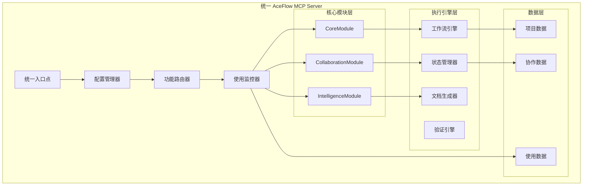

# AceFlow MCP Server 统一架构设计文档

## 📋 概述

本文档详细设计了 AceFlow MCP Server 的统一架构方案，将现有的 `aceflow-server` 和 `aceflow-enhanced-server` 整合为单一的、可配置的、模块化的 MCP 服务器。

## 🎯 设计目标

### 主要目标
1. **统一入口**: 只保留一个 MCP 服务器入口点
2. **向后兼容**: 现有用户无需修改配置即可使用
3. **渐进式功能**: 用户可以按需启用增强功能
4. **模块化设计**: 内部采用模块化架构，为未来演进做准备
5. **维护简化**: 降低代码重复和维护成本

### 次要目标
1. **性能优化**: 减少不必要的功能开销
2. **配置灵活**: 支持细粒度的功能控制
3. **监控支持**: 收集使用数据，指导未来架构演进
4. **扩展性**: 为新功能添加预留接口

## 🏗️ 整体架构设计

### 架构概览



### 模块职责划分

#### 1. **CoreModule (核心模块)**
- **职责**: 提供基础的 AceFlow 功能
- **工具**: `aceflow_init`, `aceflow_stage`, `aceflow_validate`, `aceflow_template`
- **特点**: 无状态、高性能、向后兼容

#### 2. **CollaborationModule (协作模块)**
- **职责**: 提供 AI-人协作功能
- **工具**: 协作增强版本的核心工具
- **特点**: 有状态、交互式、智能推进

#### 3. **IntelligenceModule (智能模块)**
- **职责**: 提供意图识别和智能决策
- **工具**: 意图识别、自适应指导、智能洞察
- **特点**: AI驱动、学习型、个性化

## 🔧 详细技术设计

### 1. 统一入口点设计

```python
# aceflow_mcp_server/unified_server.py

from fastmcp import FastMCP
from typing import Dict, Any, Optional
import click
from .config import UnifiedConfig
from .modules import CoreModule, CollaborationModule, IntelligenceModule
from .router import FunctionRouter
from .monitor import UsageMonitor

class UnifiedAceFlowServer:
    """统一的 AceFlow MCP 服务器"""
    
    def __init__(self, config: Optional[UnifiedConfig] = None):
        """初始化统一服务器"""
        self.config = config or UnifiedConfig.load_default()
        self.mcp = FastMCP("AceFlow-Unified")
        
        # 初始化模块
        self.core_module = CoreModule(self.config.core)
        self.collab_module = CollaborationModule(self.config.collaboration)
        self.intel_module = IntelligenceModule(self.config.intelligence)
        
        # 初始化路由器和监控器
        self.router = FunctionRouter(self.config)
        self.monitor = UsageMonitor(self.config.monitoring)
        
        # 注册工具
        self._register_tools()
        self._register_resources()
        self._register_prompts()
    
    def _register_tools(self):
        """注册所有工具"""
        # 注册统一的工具接口
        self._register_unified_tools()
        
        # 根据配置注册增强工具
        if self.config.collaboration.enabled:
            self._register_collaboration_tools()
        
        if self.config.intelligence.enabled:
            self._register_intelligence_tools()
    
    def _register_unified_tools(self):
        """注册统一的工具接口"""
        
        @self.mcp.tool
        def aceflow_init(
            mode: str,
            project_name: Optional[str] = None,
            directory: Optional[str] = None,
            # 新增配置参数
            collaboration_enabled: Optional[bool] = None,
            intelligence_enabled: Optional[bool] = None
        ) -> Dict[str, Any]:
            """🚀 Initialize AceFlow project with unified configuration."""
            
            # 动态配置覆盖
            runtime_config = self._create_runtime_config(
                collaboration_enabled, intelligence_enabled
            )
            
            # 监控使用情况
            self.monitor.track_tool_usage("aceflow_init", {
                "mode": mode,
                "collaboration": runtime_config.collaboration.enabled,
                "intelligence": runtime_config.intelligence.enabled
            })
            
            # 执行初始化
            return self.core_module.aceflow_init(
                mode, project_name, directory, runtime_config
            )
        
        @self.mcp.tool
        def aceflow_stage(
            action: str,
            stage: Optional[str] = None,
            # 兼容原有参数
            
            # 新增协作参数
            user_input: Optional[str] = None,
            auto_confirm: Optional[bool] = None,
            collaboration_mode: Optional[str] = None
        ) -> Dict[str, Any]:
            """📊 Unified stage management with optional collaboration."""
            
            # 路由决策
            execution_plan = self.router.plan_execution(
                tool_name="aceflow_stage",
                params={
                    "action": action,
                    "stage": stage,
                    "user_input": user_input,
                    "auto_confirm": auto_confirm,
                    "collaboration_mode": collaboration_mode
                }
            )
            
            # 监控使用情况
            self.monitor.track_tool_usage("aceflow_stage", execution_plan.metadata)
            
            # 执行工具
            return self._execute_with_plan(execution_plan)
        
        @self.mcp.tool
        def aceflow_validate(
            mode: str = "basic",
            fix: bool = False,
            report: bool = False,
            # 新增质量级别参数
            validation_level: Optional[str] = None,
            generate_report: Optional[bool] = None
        ) -> Dict[str, Any]:
            """✅ Unified project validation with enhanced quality checks."""
            
            # 智能参数映射
            if validation_level or generate_report is not None:
                # 使用增强验证
                return self._execute_enhanced_validation(
                    validation_level or "standard",
                    generate_report if generate_report is not None else report
                )
            else:
                # 使用基础验证
                return self.core_module.aceflow_validate(mode, fix, report)
    
    def _register_collaboration_tools(self):
        """注册协作工具"""
        
        @self.mcp.tool
        def aceflow_respond(
            request_id: str,
            response: str,
            user_id: str = "user"
        ) -> Dict[str, Any]:
            """💬 Respond to collaboration requests."""
            return self.collab_module.aceflow_respond(request_id, response, user_id)
        
        @self.mcp.tool
        def aceflow_collaboration_status(
            project_id: Optional[str] = None
        ) -> Dict[str, Any]:
            """📊 Get collaboration status and insights."""
            return self.collab_module.aceflow_collaboration_status(project_id)
        
        @self.mcp.tool
        def aceflow_task_execute(
            task_id: Optional[str] = None,
            auto_confirm: bool = False
        ) -> Dict[str, Any]:
            """📋 Execute tasks with collaborative confirmation."""
            return self.collab_module.aceflow_task_execute(task_id, auto_confirm)
    
    def _register_intelligence_tools(self):
        """注册智能工具"""
        
        @self.mcp.tool
        def aceflow_intent_analyze(
            user_input: str,
            context: Optional[Dict[str, Any]] = None
        ) -> Dict[str, Any]:
            """🧠 Analyze user intent and suggest actions."""
            return self.intel_module.analyze_intent(user_input, context)
        
        @self.mcp.tool
        def aceflow_recommend(
            context: Optional[Dict[str, Any]] = None
        ) -> Dict[str, Any]:
            """💡 Get intelligent recommendations for next actions."""
            return self.intel_module.get_recommendations(context)
```

### 2. 配置管理设计

```python
# aceflow_mcp_server/config.py

from dataclasses import dataclass, field
from typing import Dict, Any, Optional
import json
from pathlib import Path

@dataclass
class CoreConfig:
    """核心模块配置"""
    enabled: bool = True
    default_mode: str = "standard"
    auto_advance: bool = False
    quality_threshold: float = 0.8

@dataclass
class CollaborationConfig:
    """协作模块配置"""
    enabled: bool = False
    confirmation_timeout: int = 300
    auto_confirm: bool = False
    interaction_level: str = "standard"  # minimal, standard, full
    
@dataclass
class IntelligenceConfig:
    """智能模块配置"""
    enabled: bool = False
    intent_recognition: bool = True
    adaptive_guidance: bool = True
    learning_enabled: bool = False

@dataclass
class MonitoringConfig:
    """监控配置"""
    enabled: bool = True
    usage_tracking: bool = True
    performance_tracking: bool = True
    data_retention_days: int = 30

@dataclass
class UnifiedConfig:
    """统一配置"""
    mode: str = "standard"  # basic, standard, enhanced, auto
    core: CoreConfig = field(default_factory=CoreConfig)
    collaboration: CollaborationConfig = field(default_factory=CollaborationConfig)
    intelligence: IntelligenceConfig = field(default_factory=IntelligenceConfig)
    monitoring: MonitoringConfig = field(default_factory=MonitoringConfig)
    
    @classmethod
    def load_default(cls) -> 'UnifiedConfig':
        """加载默认配置"""
        return cls()
    
    @classmethod
    def load_from_file(cls, config_path: Path) -> 'UnifiedConfig':
        """从文件加载配置"""
        if not config_path.exists():
            return cls.load_default()
        
        with open(config_path, 'r', encoding='utf-8') as f:
            config_data = json.load(f)
        
        return cls.from_dict(config_data)
    
    @classmethod
    def from_dict(cls, data: Dict[str, Any]) -> 'UnifiedConfig':
        """从字典创建配置"""
        # 智能模式映射
        mode = data.get('mode', 'standard')
        
        if mode == 'basic':
            collaboration_enabled = False
            intelligence_enabled = False
        elif mode == 'enhanced':
            collaboration_enabled = True
            intelligence_enabled = True
        elif mode == 'auto':
            # 自动模式：根据使用情况动态启用
            collaboration_enabled = data.get('collaboration', {}).get('enabled', False)
            intelligence_enabled = data.get('intelligence', {}).get('enabled', False)
        else:  # standard
            collaboration_enabled = data.get('collaboration', {}).get('enabled', False)
            intelligence_enabled = data.get('intelligence', {}).get('enabled', False)
        
        return cls(
            mode=mode,
            core=CoreConfig(**data.get('core', {})),
            collaboration=CollaborationConfig(
                enabled=collaboration_enabled,
                **data.get('collaboration', {})
            ),
            intelligence=IntelligenceConfig(
                enabled=intelligence_enabled,
                **data.get('intelligence', {})
            ),
            monitoring=MonitoringConfig(**data.get('monitoring', {}))
        )
    
    def to_dict(self) -> Dict[str, Any]:
        """转换为字典"""
        return {
            'mode': self.mode,
            'core': self.core.__dict__,
            'collaboration': self.collaboration.__dict__,
            'intelligence': self.intelligence.__dict__,
            'monitoring': self.monitoring.__dict__
        }
    
    def save_to_file(self, config_path: Path):
        """保存到文件"""
        config_path.parent.mkdir(parents=True, exist_ok=True)
        with open(config_path, 'w', encoding='utf-8') as f:
            json.dump(self.to_dict(), f, indent=2, ensure_ascii=False)
```

### 3. 功能路由器设计

```python
# aceflow_mcp_server/router.py

from dataclasses import dataclass
from typing import Dict, Any, Optional, List
from enum import Enum

class ExecutionMode(Enum):
    """执行模式"""
    CORE_ONLY = "core_only"
    CORE_WITH_COLLABORATION = "core_with_collaboration"
    CORE_WITH_INTELLIGENCE = "core_with_intelligence"
    FULL_ENHANCED = "full_enhanced"

@dataclass
class ExecutionPlan:
    """执行计划"""
    mode: ExecutionMode
    primary_module: str
    enhancement_modules: List[str]
    parameters: Dict[str, Any]
    metadata: Dict[str, Any]

class FunctionRouter:
    """功能路由器"""
    
    def __init__(self, config: UnifiedConfig):
        self.config = config
    
    def plan_execution(self, tool_name: str, params: Dict[str, Any]) -> ExecutionPlan:
        """规划工具执行方案"""
        
        if tool_name == "aceflow_stage":
            return self._plan_stage_execution(params)
        elif tool_name == "aceflow_validate":
            return self._plan_validation_execution(params)
        elif tool_name == "aceflow_init":
            return self._plan_init_execution(params)
        else:
            # 默认核心执行
            return ExecutionPlan(
                mode=ExecutionMode.CORE_ONLY,
                primary_module="core",
                enhancement_modules=[],
                parameters=params,
                metadata={"tool": tool_name, "mode": "core_only"}
            )
    
    def _plan_stage_execution(self, params: Dict[str, Any]) -> ExecutionPlan:
        """规划阶段管理执行"""
        user_input = params.get('user_input')
        collaboration_mode = params.get('collaboration_mode')
        auto_confirm = params.get('auto_confirm')
        
        # 决策逻辑
        needs_collaboration = (
            self.config.collaboration.enabled and
            (user_input or collaboration_mode == "enhanced" or 
             (collaboration_mode is None and not auto_confirm))
        )
        
        needs_intelligence = (
            self.config.intelligence.enabled and
            user_input and
            self.config.intelligence.intent_recognition
        )
        
        if needs_collaboration and needs_intelligence:
            mode = ExecutionMode.FULL_ENHANCED
            enhancements = ["collaboration", "intelligence"]
        elif needs_collaboration:
            mode = ExecutionMode.CORE_WITH_COLLABORATION
            enhancements = ["collaboration"]
        elif needs_intelligence:
            mode = ExecutionMode.CORE_WITH_INTELLIGENCE
            enhancements = ["intelligence"]
        else:
            mode = ExecutionMode.CORE_ONLY
            enhancements = []
        
        return ExecutionPlan(
            mode=mode,
            primary_module="core",
            enhancement_modules=enhancements,
            parameters=params,
            metadata={
                "tool": "aceflow_stage",
                "mode": mode.value,
                "has_user_input": bool(user_input),
                "collaboration_requested": needs_collaboration,
                "intelligence_requested": needs_intelligence
            }
        )
    
    def _plan_validation_execution(self, params: Dict[str, Any]) -> ExecutionPlan:
        """规划验证执行"""
        validation_level = params.get('validation_level')
        
        if validation_level and validation_level != "basic":
            # 使用增强验证
            return ExecutionPlan(
                mode=ExecutionMode.CORE_WITH_INTELLIGENCE,
                primary_module="core",
                enhancement_modules=["intelligence"],
                parameters=params,
                metadata={"tool": "aceflow_validate", "mode": "enhanced"}
            )
        else:
            # 使用基础验证
            return ExecutionPlan(
                mode=ExecutionMode.CORE_ONLY,
                primary_module="core",
                enhancement_modules=[],
                parameters=params,
                metadata={"tool": "aceflow_validate", "mode": "basic"}
            )
    
    def _plan_init_execution(self, params: Dict[str, Any]) -> ExecutionPlan:
        """规划初始化执行"""
        collaboration_enabled = params.get('collaboration_enabled')
        intelligence_enabled = params.get('intelligence_enabled')
        
        enhancements = []
        if collaboration_enabled or self.config.collaboration.enabled:
            enhancements.append("collaboration")
        if intelligence_enabled or self.config.intelligence.enabled:
            enhancements.append("intelligence")
        
        if len(enhancements) == 2:
            mode = ExecutionMode.FULL_ENHANCED
        elif "collaboration" in enhancements:
            mode = ExecutionMode.CORE_WITH_COLLABORATION
        elif "intelligence" in enhancements:
            mode = ExecutionMode.CORE_WITH_INTELLIGENCE
        else:
            mode = ExecutionMode.CORE_ONLY
        
        return ExecutionPlan(
            mode=mode,
            primary_module="core",
            enhancement_modules=enhancements,
            parameters=params,
            metadata={"tool": "aceflow_init", "mode": mode.value}
        )
```

### 4. 使用监控器设计

```python
# aceflow_mcp_server/monitor.py

from dataclasses import dataclass, field
from typing import Dict, Any, List
from datetime import datetime, timedelta
import json
from pathlib import Path

@dataclass
class UsageRecord:
    """使用记录"""
    timestamp: datetime
    tool_name: str
    parameters: Dict[str, Any]
    execution_mode: str
    duration_ms: float
    success: bool
    error: Optional[str] = None

@dataclass
class UsageStats:
    """使用统计"""
    total_calls: int = 0
    successful_calls: int = 0
    failed_calls: int = 0
    avg_duration_ms: float = 0.0
    mode_distribution: Dict[str, int] = field(default_factory=dict)
    tool_distribution: Dict[str, int] = field(default_factory=dict)

class UsageMonitor:
    """使用监控器"""
    
    def __init__(self, config: MonitoringConfig):
        self.config = config
        self.records: List[UsageRecord] = []
        self.data_file = Path(".aceflow/monitoring/usage_data.json")
        
        if config.enabled:
            self._load_existing_data()
    
    def track_tool_usage(
        self,
        tool_name: str,
        metadata: Dict[str, Any],
        duration_ms: float = 0.0,
        success: bool = True,
        error: Optional[str] = None
    ):
        """跟踪工具使用"""
        if not self.config.enabled:
            return
        
        record = UsageRecord(
            timestamp=datetime.now(),
            tool_name=tool_name,
            parameters=metadata,
            execution_mode=metadata.get('mode', 'unknown'),
            duration_ms=duration_ms,
            success=success,
            error=error
        )
        
        self.records.append(record)
        
        # 定期清理旧数据
        self._cleanup_old_records()
        
        # 定期保存数据
        if len(self.records) % 10 == 0:
            self._save_data()
    
    def get_usage_stats(self, days: int = 7) -> UsageStats:
        """获取使用统计"""
        cutoff_date = datetime.now() - timedelta(days=days)
        recent_records = [r for r in self.records if r.timestamp >= cutoff_date]
        
        if not recent_records:
            return UsageStats()
        
        stats = UsageStats()
        stats.total_calls = len(recent_records)
        stats.successful_calls = sum(1 for r in recent_records if r.success)
        stats.failed_calls = stats.total_calls - stats.successful_calls
        
        if recent_records:
            stats.avg_duration_ms = sum(r.duration_ms for r in recent_records) / len(recent_records)
        
        # 模式分布
        for record in recent_records:
            mode = record.execution_mode
            stats.mode_distribution[mode] = stats.mode_distribution.get(mode, 0) + 1
        
        # 工具分布
        for record in recent_records:
            tool = record.tool_name
            stats.tool_distribution[tool] = stats.tool_distribution.get(tool, 0) + 1
        
        return stats
    
    def get_recommendations(self) -> List[str]:
        """基于使用数据生成配置建议"""
        stats = self.get_usage_stats(30)  # 30天数据
        recommendations = []
        
        if stats.total_calls == 0:
            return ["No usage data available for recommendations"]
        
        # 分析协作功能使用
        collab_usage = (
            stats.mode_distribution.get('core_with_collaboration', 0) +
            stats.mode_distribution.get('full_enhanced', 0)
        )
        collab_ratio = collab_usage / stats.total_calls
        
        if collab_ratio > 0.7:
            recommendations.append("High collaboration usage detected. Consider enabling collaboration by default.")
        elif collab_ratio < 0.1:
            recommendations.append("Low collaboration usage. Consider disabling collaboration to improve performance.")
        
        # 分析智能功能使用
        intel_usage = (
            stats.mode_distribution.get('core_with_intelligence', 0) +
            stats.mode_distribution.get('full_enhanced', 0)
        )
        intel_ratio = intel_usage / stats.total_calls
        
        if intel_ratio > 0.6:
            recommendations.append("High intelligence usage detected. Consider enabling intelligence features by default.")
        elif intel_ratio < 0.1:
            recommendations.append("Low intelligence usage. Consider disabling intelligence features to improve performance.")
        
        # 分析性能
        if stats.avg_duration_ms > 5000:  # 5秒
            recommendations.append("High average response time detected. Consider optimizing configuration or disabling unused features.")
        
        return recommendations
    
    def _load_existing_data(self):
        """加载现有数据"""
        if not self.data_file.exists():
            return
        
        try:
            with open(self.data_file, 'r', encoding='utf-8') as f:
                data = json.load(f)
            
            self.records = [
                UsageRecord(
                    timestamp=datetime.fromisoformat(r['timestamp']),
                    tool_name=r['tool_name'],
                    parameters=r['parameters'],
                    execution_mode=r['execution_mode'],
                    duration_ms=r['duration_ms'],
                    success=r['success'],
                    error=r.get('error')
                )
                for r in data.get('records', [])
            ]
        except Exception as e:
            print(f"Failed to load usage data: {e}")
    
    def _save_data(self):
        """保存数据"""
        self.data_file.parent.mkdir(parents=True, exist_ok=True)
        
        data = {
            'records': [
                {
                    'timestamp': r.timestamp.isoformat(),
                    'tool_name': r.tool_name,
                    'parameters': r.parameters,
                    'execution_mode': r.execution_mode,
                    'duration_ms': r.duration_ms,
                    'success': r.success,
                    'error': r.error
                }
                for r in self.records
            ]
        }
        
        try:
            with open(self.data_file, 'w', encoding='utf-8') as f:
                json.dump(data, f, indent=2, ensure_ascii=False)
        except Exception as e:
            print(f"Failed to save usage data: {e}")
    
    def _cleanup_old_records(self):
        """清理旧记录"""
        if not self.config.usage_tracking:
            return
        
        cutoff_date = datetime.now() - timedelta(days=self.config.data_retention_days)
        self.records = [r for r in self.records if r.timestamp >= cutoff_date]
```

### 5. 模块接口设计

```python
# aceflow_mcp_server/modules/base.py

from abc import ABC, abstractmethod
from typing import Dict, Any, Optional

class BaseModule(ABC):
    """模块基类"""
    
    def __init__(self, config: Any):
        self.config = config
        self.enabled = getattr(config, 'enabled', True)
    
    @abstractmethod
    def get_module_name(self) -> str:
        """获取模块名称"""
        pass
    
    @abstractmethod
    def initialize(self) -> bool:
        """初始化模块"""
        pass
    
    @abstractmethod
    def cleanup(self):
        """清理模块资源"""
        pass

# aceflow_mcp_server/modules/core.py

from .base import BaseModule
from ..config import CoreConfig
from ..tools import AceFlowTools  # 原有的工具类

class CoreModule(BaseModule):
    """核心模块"""
    
    def __init__(self, config: CoreConfig):
        super().__init__(config)
        self.tools = AceFlowTools()
    
    def get_module_name(self) -> str:
        return "core"
    
    def initialize(self) -> bool:
        return True
    
    def cleanup(self):
        pass
    
    def aceflow_init(
        self,
        mode: str,
        project_name: Optional[str] = None,
        directory: Optional[str] = None,
        runtime_config: Optional[Any] = None
    ) -> Dict[str, Any]:
        """初始化项目"""
        # 调用原有的初始化逻辑
        result = self.tools.aceflow_init(mode, project_name, directory)
        
        # 如果有运行时配置，保存配置信息
        if runtime_config:
            self._save_runtime_config(result, runtime_config)
        
        return result
    
    def aceflow_stage(
        self,
        action: str,
        stage: Optional[str] = None
    ) -> Dict[str, Any]:
        """基础阶段管理"""
        return self.tools.aceflow_stage(action, stage)
    
    def aceflow_validate(
        self,
        mode: str = "basic",
        fix: bool = False,
        report: bool = False
    ) -> Dict[str, Any]:
        """基础验证"""
        return self.tools.aceflow_validate(mode, fix, report)
    
    def _save_runtime_config(self, init_result: Dict[str, Any], runtime_config: Any):
        """保存运行时配置"""
        if init_result.get('success'):
            project_dir = init_result.get('project_info', {}).get('directory', '.')
            config_path = Path(project_dir) / '.aceflow' / 'runtime_config.json'
            runtime_config.save_to_file(config_path)

# aceflow_mcp_server/modules/collaboration.py

from .base import BaseModule
from ..config import CollaborationConfig
from ..enhanced_tools import EnhancedAceFlowTools  # 原有的增强工具类

class CollaborationModule(BaseModule):
    """协作模块"""
    
    def __init__(self, config: CollaborationConfig):
        super().__init__(config)
        if self.enabled:
            self.enhanced_tools = EnhancedAceFlowTools()
    
    def get_module_name(self) -> str:
        return "collaboration"
    
    def initialize(self) -> bool:
        return self.enabled
    
    def cleanup(self):
        if hasattr(self, 'enhanced_tools'):
            # 清理协作资源
            pass
    
    def enhance_stage_execution(
        self,
        core_result: Dict[str, Any],
        user_input: Optional[str] = None,
        auto_confirm: Optional[bool] = None
    ) -> Dict[str, Any]:
        """增强阶段执行"""
        if not self.enabled:
            return core_result
        
        # 使用原有的协作逻辑
        return self.enhanced_tools.aceflow_stage_collaborative(
            action="enhance_result",
            user_input=user_input,
            auto_confirm=auto_confirm or self.config.auto_confirm,
            base_result=core_result
        )
    
    def aceflow_respond(
        self,
        request_id: str,
        response: str,
        user_id: str = "user"
    ) -> Dict[str, Any]:
        """响应协作请求"""
        if not self.enabled:
            return {"success": False, "error": "Collaboration module not enabled"}
        
        return self.enhanced_tools.aceflow_respond(request_id, response, user_id)
    
    def aceflow_collaboration_status(
        self,
        project_id: Optional[str] = None
    ) -> Dict[str, Any]:
        """获取协作状态"""
        if not self.enabled:
            return {"success": False, "error": "Collaboration module not enabled"}
        
        return self.enhanced_tools.aceflow_collaboration_status(project_id)
    
    def aceflow_task_execute(
        self,
        task_id: Optional[str] = None,
        auto_confirm: bool = False
    ) -> Dict[str, Any]:
        """执行任务"""
        if not self.enabled:
            return {"success": False, "error": "Collaboration module not enabled"}
        
        return self.enhanced_tools.aceflow_task_execute(task_id, auto_confirm)

# aceflow_mcp_server/modules/intelligence.py

from .base import BaseModule
from ..config import IntelligenceConfig
from ..core.intent_recognizer import IntentRecognizer

class IntelligenceModule(BaseModule):
    """智能模块"""
    
    def __init__(self, config: IntelligenceConfig):
        super().__init__(config)
        if self.enabled:
            self.intent_recognizer = IntentRecognizer()
    
    def get_module_name(self) -> str:
        return "intelligence"
    
    def initialize(self) -> bool:
        return self.enabled
    
    def cleanup(self):
        pass
    
    def analyze_intent(
        self,
        user_input: str,
        context: Optional[Dict[str, Any]] = None
    ) -> Dict[str, Any]:
        """分析用户意图"""
        if not self.enabled:
            return {"success": False, "error": "Intelligence module not enabled"}
        
        intent_result = self.intent_recognizer.recognize_intent(user_input, context)
        
        return {
            "success": True,
            "intent": {
                "type": intent_result.intent_type.value,
                "confidence": intent_result.confidence,
                "parameters": intent_result.parameters,
                "suggested_action": intent_result.suggested_action,
                "reasoning": intent_result.reasoning
            }
        }
    
    def get_recommendations(
        self,
        context: Optional[Dict[str, Any]] = None
    ) -> Dict[str, Any]:
        """获取智能推荐"""
        if not self.enabled:
            return {"success": False, "error": "Intelligence module not enabled"}
        
        # 基于上下文生成推荐
        recommendations = self._generate_recommendations(context or {})
        
        return {
            "success": True,
            "recommendations": recommendations
        }
    
    def enhance_validation(
        self,
        validation_level: str,
        generate_report: bool = True
    ) -> Dict[str, Any]:
        """增强验证"""
        if not self.enabled:
            return {"success": False, "error": "Intelligence module not enabled"}
        
        # 使用智能验证逻辑
        from ..core.validation_engine import ValidationEngine, ValidationLevel
        
        level_map = {
            "basic": ValidationLevel.BASIC,
            "standard": ValidationLevel.STANDARD,
            "strict": ValidationLevel.STRICT
        }
        
        engine = ValidationEngine(level_map.get(validation_level, ValidationLevel.STANDARD))
        return engine.generate_quality_report() if generate_report else engine.validate()
    
    def _generate_recommendations(self, context: Dict[str, Any]) -> List[Dict[str, Any]]:
        """生成推荐"""
        recommendations = []
        
        current_stage = context.get('current_stage', 'unknown')
        progress = context.get('progress', 0)
        
        if progress > 80:
            recommendations.append({
                "type": "stage_advancement",
                "priority": "high",
                "title": "准备推进到下一阶段",
                "description": f"当前阶段 {current_stage} 进度已达 {progress}%",
                "action": "aceflow_stage(action='next')"
            })
        
        return recommendations
```

## 🚀 实施计划

### 阶段1: 基础架构搭建 (1-2周)

#### 1.1 创建统一入口点
- [ ] 创建 `UnifiedAceFlowServer` 类
- [ ] 实现基础的配置管理
- [ ] 创建模块基类和接口

#### 1.2 实现核心模块
- [ ] 将现有 `AceFlowTools` 封装为 `CoreModule`
- [ ] 确保向后兼容性
- [ ] 添加基础测试

#### 1.3 配置系统
- [ ] 实现 `UnifiedConfig` 类
- [ ] 支持从文件和环境变量加载配置
- [ ] 实现配置验证和默认值

### 阶段2: 模块整合 (2-3周)

#### 2.1 协作模块整合
- [ ] 将 `EnhancedAceFlowTools` 重构为 `CollaborationModule`
- [ ] 实现模块间的接口调用
- [ ] 确保协作功能的完整性

#### 2.2 智能模块整合
- [ ] 创建 `IntelligenceModule`
- [ ] 整合意图识别和智能推荐功能
- [ ] 实现增强验证功能

#### 2.3 功能路由器
- [ ] 实现 `FunctionRouter` 类
- [ ] 添加智能路由决策逻辑
- [ ] 支持动态功能组合

### 阶段3: 监控和优化 (1周)

#### 3.1 使用监控
- [ ] 实现 `UsageMonitor` 类
- [ ] 添加使用数据收集
- [ ] 实现配置推荐功能

#### 3.2 性能优化
- [ ] 优化模块加载和初始化
- [ ] 实现懒加载机制
- [ ] 添加性能监控

### 阶段4: 测试和文档 (1周)

#### 4.1 全面测试
- [ ] 单元测试覆盖所有模块
- [ ] 集成测试验证模块间交互
- [ ] 兼容性测试确保向后兼容

#### 4.2 文档更新
- [ ] 更新用户文档
- [ ] 创建迁移指南
- [ ] 编写配置参考

## 📋 配置示例

### 基础模式配置
```json
{
  "mode": "basic",
  "core": {
    "enabled": true,
    "default_mode": "standard",
    "auto_advance": true
  },
  "collaboration": {
    "enabled": false
  },
  "intelligence": {
    "enabled": false
  }
}
```

### 增强模式配置
```json
{
  "mode": "enhanced",
  "core": {
    "enabled": true,
    "default_mode": "complete",
    "auto_advance": false
  },
  "collaboration": {
    "enabled": true,
    "confirmation_timeout": 300,
    "interaction_level": "full"
  },
  "intelligence": {
    "enabled": true,
    "intent_recognition": true,
    "adaptive_guidance": true
  }
}
```

### 自动模式配置
```json
{
  "mode": "auto",
  "collaboration": {
    "enabled": "auto",
    "auto_confirm": false
  },
  "intelligence": {
    "enabled": "auto",
    "learning_enabled": true
  },
  "monitoring": {
    "enabled": true,
    "usage_tracking": true
  }
}
```

## 🔄 迁移策略

### 现有用户迁移

#### 1. 自动检测现有配置
```python
def detect_legacy_config():
    """检测现有配置"""
    if Path("mcp.json").exists():
        with open("mcp.json") as f:
            config = json.load(f)
        
        if "aceflow-enhanced" in config.get("mcpServers", {}):
            return "enhanced"
        elif "aceflow" in config.get("mcpServers", {}):
            return "basic"
    
    return "standard"
```

#### 2. 配置自动迁移
```python
def migrate_config(legacy_mode: str) -> UnifiedConfig:
    """迁移配置"""
    if legacy_mode == "enhanced":
        return UnifiedConfig(
            mode="enhanced",
            collaboration=CollaborationConfig(enabled=True),
            intelligence=IntelligenceConfig(enabled=True)
        )
    elif legacy_mode == "basic":
        return UnifiedConfig(
            mode="basic",
            collaboration=CollaborationConfig(enabled=False),
            intelligence=IntelligenceConfig(enabled=False)
        )
    else:
        return UnifiedConfig.load_default()
```

#### 3. 平滑过渡
- 保持原有的工具调用方式不变
- 新参数为可选，有合理默认值
- 提供配置升级工具

## 📊 成功指标

### 技术指标
1. **向后兼容性**: 100% 现有API调用正常工作
2. **性能**: 基础模式性能不下降，增强模式性能提升20%
3. **代码重复**: 减少代码重复50%以上
4. **测试覆盖**: 单元测试覆盖率 > 90%

### 用户体验指标
1. **迁移成功率**: 95% 用户无需修改配置即可使用
2. **功能发现**: 60% 用户在30天内尝试新功能
3. **配置简化**: 配置复杂度降低40%
4. **文档满意度**: 用户文档评分 > 4.5/5

### 维护指标
1. **Bug修复时间**: 平均修复时间减少50%
2. **新功能开发**: 新功能开发周期缩短30%
3. **代码审查**: 代码审查时间减少40%
4. **发布频率**: 支持更频繁的功能发布

## 🔮 未来演进路径

### 短期 (3-6个月)
- 基于使用数据优化默认配置
- 添加更多智能推荐功能
- 支持团队协作功能

### 中期 (6-12个月)
- 实现真正的分层架构 (方案2)
- 支持插件系统
- 添加云端同步功能

### 长期 (1-2年)
- 微服务化架构
- AI驱动的个性化配置
- 生态系统和市场

---

*设计文档版本: 1.0*  
*创建时间: 2024-01-XX*  
*最后更新: 2024-01-XX*