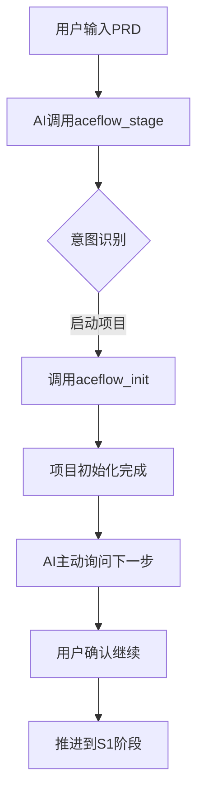
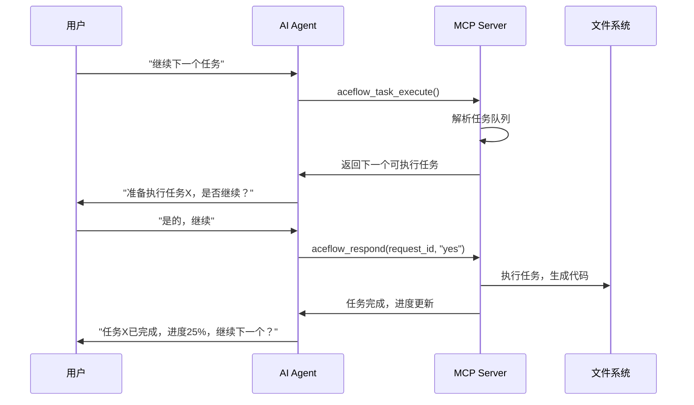

# AceFlow MCP Server 工作流程分析

## 📋 概述

本文档分析了在 Kiro 或 Cursor 等 AI IDE 中使用 AceFlow MCP Server 的实际工作流程，包括用户交互模式、技术实现要点和预期用户价值。

## 🎯 典型的用户工作流程

### 场景1: 新项目启动流程

**用户操作**:
```
用户: "我想开发一个任务管理系统，这是我的PRD文档..."
```

**AI Agent 内部流程**:


**实际MCP调用序列**:
```python
# 1. AI识别意图并初始化项目
aceflow_stage(
    action="status",
    user_input="我想开发一个任务管理系统，这是我的PRD文档..."
)
# 返回: 建议启动complete模式

# 2. 初始化项目
aceflow_init(mode="complete", project_name="task-manager")

# 3. AI主动推进流程
aceflow_stage(
    action="collaborative_execute",
    user_input="开始S1用户故事分析"
)
# 返回: 协作请求ID，等待用户确认

# 4. 用户确认后继续
aceflow_respond(request_id="req_123", response="yes")
```

### 场景2: 开发过程中的协作流程

**用户操作**:
```
用户: "继续下一个任务"
```

**工作流程**:


### 场景3: 状态查询和决策流程

**用户操作**:
```
用户: "现在项目进展如何？"
```

**AI处理流程**:
```python
# 1. 获取智能项目状态
intelligent_state = get_resource("aceflow://project/intelligent-state/current")

# 2. 获取协作洞察
insights = get_resource("aceflow://collaboration/insights/current")

# 3. AI分析并回复用户
AI回复: """
📊 项目状态更新：
- 当前阶段：S2 任务分解 (75%完成)
- 总体进度：37.5%
- 已完成：S1用户故事分析 ✅
- 进行中：S2任务分解 🔄
- 待处理：1个协作请求

💡 建议：任务分解即将完成，建议准备进入S3测试用例设计阶段
"""
```

## 🔄 不同使用模式的工作流程

### 模式1: 基础自动化模式 (适合简单项目)

```python
# 配置
{
  "mode": "basic",
  "auto_advance": true,
  "collaboration": false
}

# 工作流程
用户: "初始化标准项目" 
→ aceflow_init(mode="standard")
→ aceflow_stage(action="execute") # 自动执行所有阶段
→ 项目完成
```

### 模式2: 协作确认模式 (适合中等项目)

```python
# 配置  
{
  "mode": "standard",
  "auto_advance": false,
  "collaboration": true,
  "confirmation_level": "stage"
}

# 工作流程
用户: "开始开发博客系统"
→ AI识别意图 → 初始化项目
→ 执行S1 → AI询问"S1完成，继续S2？"
→ 用户确认 → 执行S2 → ...
```

### 模式3: 深度协作模式 (适合复杂项目)

```python
# 配置
{
  "mode": "complete", 
  "auto_advance": false,
  "collaboration": true,
  "confirmation_level": "task",
  "intent_recognition": true
}

# 工作流程 - 任务级协作
用户: "我想实现用户认证功能"
→ AI解析任务队列 → 找到相关任务
→ AI询问"发现3个相关任务，从哪个开始？"
→ 用户选择 → 执行单个任务
→ AI询问"任务完成，继续下一个？"
```

## 🎨 在不同IDE中的用户体验

### 在 Cursor 中的体验

```
用户在聊天框输入：
"@aceflow 我想开发一个电商系统，需要用户管理、商品管理、订单处理功能"

Cursor AI 响应：
🚀 检测到新项目需求！我来帮你启动AceFlow工作流。

[调用 aceflow_stage 进行意图识别]

📋 建议启动 Complete 模式工作流，包含以下阶段：
- S1: 用户故事分析
- S2: 任务分解  
- S3: 测试用例设计
- S4: 架构设计
- S5: 功能实现
- S6: 单元测试
- S7: 集成测试
- S8: 代码审查和交付

是否开始？

用户: "好的，开始吧"

[调用 aceflow_init 初始化项目]

✅ 项目 'ecommerce-system' 已初始化
📁 创建了项目结构和配置文件
🎯 准备开始 S1: 用户故事分析

[调用 aceflow_stage_collaborative 执行S1]

📝 正在分析你的需求，生成用户故事...

[生成用户故事文档]

✅ S1 用户故事分析完成！
📊 识别了15个用户故事，3个用户角色
📈 进度: 12.5% (1/8阶段完成)

🤝 是否继续进入 S2: 任务分解阶段？
```

### 在 Kiro 中的体验

```
用户通过 #aceflow 上下文：
"开始开发一个简单的待办事项应用"

Kiro 分析并调用：
aceflow_stage(action="status", user_input="开始开发一个简单的待办事项应用")

Kiro 响应：
🎯 为你的待办事项应用推荐 Standard 模式工作流

我将帮你完成以下步骤：
1. 需求分析 → 2. 设计实现 → 3. 测试验证 → 4. 交付部署

让我们开始吧！

[自动调用 aceflow_init]

✅ 项目初始化完成
📂 在当前目录创建了 .aceflow/ 和相关文件

[调用 aceflow_stage 执行第一阶段]

📋 正在进行需求分析...
- 分析功能需求：添加、删除、标记完成待办事项
- 生成技术方案：React + Node.js + SQLite
- 创建开发计划：预计4个开发任务

✅ 需求分析完成！下一步：设计实现

继续吗？
```

## 🔧 技术实现的关键点

### 1. **上下文感知**
```python
# AI Agent 需要维护对话上下文
context = {
    "current_project": "task-manager",
    "current_stage": "S2_task_breakdown", 
    "user_preferences": {"confirmation_level": "task"},
    "conversation_history": [...]
}

# 每次MCP调用都带上上下文
aceflow_stage(action="status", context=context)
```

### 2. **智能决策**
```python
# AI根据用户输入和项目状态做决策
if "继续" in user_input and current_progress > 80:
    action = "collaborative_next"
elif "任务" in user_input and current_stage == "implementation":
    action = "task_execute"  
elif "状态" in user_input or "进度" in user_input:
    action = "status"
```

### 3. **自然语言交互**
```python
# 用户可以用自然语言，AI转换为MCP调用
用户: "帮我检查一下代码质量"
→ AI调用: aceflow_validate_quality(validation_level="standard")

用户: "暂停一下，我需要修改需求"  
→ AI调用: aceflow_stage(action="pause")
```

## 📊 工作流程模式对比

| 特性 | 基础自动化模式 | 协作确认模式 | 深度协作模式 |
|------|----------------|--------------|--------------|
| **适用项目** | 简单、标准化项目 | 中等复杂度项目 | 复杂、定制化项目 |
| **用户参与度** | 最小 | 中等 | 高度参与 |
| **自动化程度** | 高 | 中等 | 低 |
| **灵活性** | 低 | 中等 | 高 |
| **学习成本** | 最低 | 中等 | 较高 |
| **适用场景** | 原型开发、标准应用 | 业务应用开发 | 企业级系统 |

## 🎯 关键交互点分析

### 1. **项目启动决策点**
- **触发**: 用户提及开发需求或PRD文档
- **AI行为**: 意图识别 → 模式推荐 → 用户确认
- **用户选择**: 接受推荐 / 修改模式 / 取消

### 2. **阶段推进决策点**
- **触发**: 当前阶段完成
- **AI行为**: 质量检查 → 进度报告 → 询问下一步
- **用户选择**: 继续 / 修改 / 暂停 / 重做

### 3. **任务执行决策点**
- **触发**: 进入实现阶段或用户请求执行任务
- **AI行为**: 任务解析 → 优先级排序 → 执行确认
- **用户选择**: 确认执行 / 调整顺序 / 修改任务

### 4. **质量控制决策点**
- **触发**: 阶段输出生成或用户请求质量检查
- **AI行为**: 质量评估 → 问题报告 → 改进建议
- **用户选择**: 接受 / 修改 / 重新执行

## 🚀 预期的用户价值

### 1. **降低学习成本**
- 用户不需要学习复杂的工具调用语法
- 自然语言交互，符合直觉
- AI主动提供指导和建议

### 2. **提高开发效率**
- AI主动推进流程，减少手动操作
- 智能任务调度和优先级管理
- 自动化的质量检查和文档生成

### 3. **保证项目质量**
- 每个阶段都有明确的输入输出要求
- 多层次的质量验证机制
- 基于最佳实践的流程指导

### 4. **增强可控性**
- 用户可以随时暂停、修改或跳过步骤
- 透明的决策过程和状态展示
- 灵活的配置和个性化设置

### 5. **促进知识传递**
- AI提供专业的开发指导
- 记录决策过程和经验教训
- 支持团队协作和知识共享

## 🔮 未来发展方向

### 1. **更智能的意图理解**
- 支持更复杂的自然语言指令
- 基于上下文的智能推理
- 多轮对话的连贯性管理

### 2. **个性化的工作流程**
- 基于用户历史行为的流程优化
- 自适应的确认频率和方式
- 个人偏好的学习和应用

### 3. **团队协作支持**
- 多人协作的工作流程管理
- 角色权限和审批流程
- 团队知识库的集成

### 4. **生态系统集成**
- 与更多开发工具的集成
- 支持不同的技术栈和框架
- 云端服务和本地部署的混合模式

## 📝 总结

AceFlow MCP Server 通过提供结构化的工作流程和智能的AI-人协作机制，将复杂的软件开发过程转化为自然、高效的交互体验。它不仅是一个工具，更是一个智能的开发伙伴，能够理解用户意图、提供专业指导、确保项目质量，并在整个开发过程中保持用户的主导地位。

这种设计让AI Agent真正成为了用户的智能助手，而不仅仅是一个被动的工具执行器。通过自然语言交互和主动的流程推进，用户可以专注于创意和决策，而将繁琐的流程管理交给AI来处理。

---

*文档创建时间: 2024-01-XX*  
*最后更新: 2024-01-XX*  
*版本: 1.0*