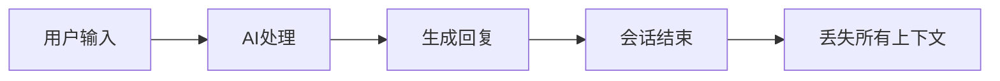
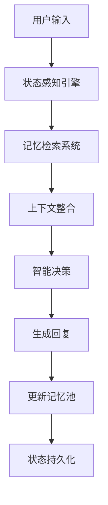
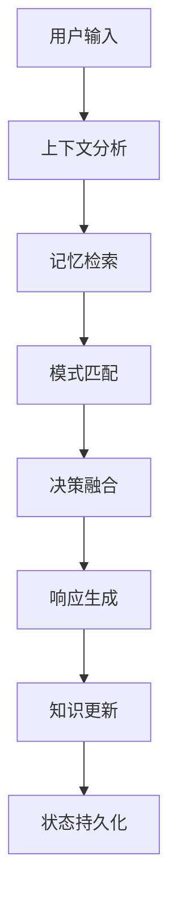

# 🚀 AceFlow：在AI编程助手中实现项目记忆

> **当AI不再是"健忘症患者"，你的开发体验将发生什么变化？**

作为一名开发者，你是否遇到过这样的困扰：

- 🤔 **反复解释相同问题**：每次向AI助手询问项目相关问题，都要重新解释背景
- 😵 **缺乏项目上下文**：AI无法理解你的代码架构、技术选型和开发历史
- 🔄 **重复造轮子**：明明之前解决过类似问题，AI却给出了完全不同的方案
- 📚 **团队知识断层**：新成员上手困难，老员工的经验难以传承

如果这些问题让你深有同感，那么今天要介绍的 **AceFlow** 可能会彻底改变你的开发体验。

---

## 💡 什么是AceFlow？

**AceFlow** 是一个探索性的AI编程助手项目，致力于解决现有AI助手的核心问题：**缺乏项目上下文的持久化记忆**。

想象一下，如果你的AI助手能够：
- 🧠 **记住你的每一次决策**和解决方案
- 📖 **理解你的项目架构**和代码风格  
- 🎯 **学习你的开发模式**并主动优化建议
- 🔗 **积累团队知识**并智能分享

这就是AceFlow带来的技术探索。

### 🌟 项目特色

```bash
# AceFlow开发日志
开发者: "如何实现用户认证？"
AI: "这里有一个通用的JWT认证示例..."

# AceFlow学习后
开发者: "如何实现用户认证？" 
AceFlow: "根据您之前在用户模块中的实现，
建议继续使用JWT + 刷新令牌的方案..."
```

**注意**：这是一个实验性项目，在探索AI与项目状态持久化的可能性。
```

---

## 🏗️ 技术创新：PATEOAS架构深度解析

**PATEOAS**（Prompt as the Engine of AI State）是AceFlow的核心技术创新。这是一个在AI编程助手领域的全新架构理念。

### 🔍 传统AI助手的技术限制



**技术问题**：
- 每次对话都是独立的，无法积累知识
- AI无法理解项目当前状态
- 缺乏项目上下文的持久化机制

### ⚡ PATEOAS架构的技术突破



**技术优势**：
- 🧠 **持久化记忆**：所有交互都被智能分类存储
- 📈 **状态感知**：理解项目当前状态和历史演进
- 🎯 **上下文关联**：基于历史数据提供个性化建议

### 🛠️ 技术实现细节

#### 1. 状态感知引擎
- **上下文分析**：解析用户输入的上下文意图
- **意图识别**：区分查询、实现、修复等不同意图
- **状态追踪**：跟踪项目的当前状态变化

#### 2. 记忆检索系统
- **向量化检索**：将交互历史转化为向量进行语义检索
- **类型分类**：按上下文、决策、模式、问题、学习分类
- **相关性排序**：基于相关性返回最匹配的历史知识

#### 3. 上下文整合
- **多源融合**：结合当前输入和历史记忆
- **冲突解决**：处理不同历史决策之间的冲突
- **权重调整**：根据时间和相关性调整信息权重

---

## 🎪 实战演示：5分钟体验AceFlow

让我们通过一个真实的开发场景来感受AceFlow的威力。

### 📝 场景：开发TaskMaster API

#### **第一步：项目初始化**

```bash
# 传统方式：手动创建项目结构
mkdir taskmaster-api
cd taskmaster-api
# ... 一系列复杂的初始化步骤

# AceFlow方式：智能初始化
aceflow init --mode smart
# ✨ AI自动分析并推荐最佳项目结构
```

#### **第二步：智能任务分析**

```bash
# 开发者输入
aceflow analyze "开发TaskMaster任务管理API，包含用户认证、任务CRUD、权限管理"

# AceFlow智能分析输出
🧠 AI分析结果:
  任务类型: 新功能开发
  复杂度: 中等
  推荐模式: Standard工作流
  预估时间: 1-2周
  置信度: 92%

💡 智能建议:
  - 基于你的历史偏好，推荐使用FastAPI框架
  - 检测到类似的JWT认证实现，可复用现有方案
  - 建议采用Repository模式，与你的代码风格保持一致
```

#### **第三步：智能记忆调用**

当你询问具体实现时：

```bash
# 开发者询问
"之前我们是怎么处理JWT令牌的？"

# AceFlow智能记忆检索
📚 智能记忆检索结果 (找到3个相关记忆)

1. [模式] JWT最佳实践实现
   - 相关度: 0.95
   - 上下文: 用户认证模块的刷新令牌机制
   - 包含代码片段和安全考虑

2. [决策] Auth0 vs 自定义JWT决策记录  
   - 相关度: 0.87
   - 结论: 小型项目用自定义JWT，企业级用Auth0

💡 上下文洞察:
- 团队偏好30分钟令牌过期时间
- 始终实现刷新令牌轮换机制
- 使用中间件模式进行路由保护
```

#### **第四步：自适应质量门控**

在开发过程中，AceFlow会智能监控代码质量：

```bash
# 当你完成API结构设计后
aceflow status

🚦 智能决策门评估

DG1 - 安全评估: ⚠️ 需要关注
- 建议: 添加输入验证中间件
- 安全隐患: 未实现速率限制

DG2 - 代码质量: ✅ 通过
- 清晰的关注点分离
- 适当的错误处理实现

🎯 下一步建议:
1. 实现安全中间件 (高优先级)
2. 添加综合测试套件
3. 设置监控和日志记录
```

---

## 💪 技术原理

### 1. 🧠 **项目记忆系统**
- **自动学习**：捕获开发决策、模式和解决方案
- **智能检索**：基于相关性的上下文感知搜索  
- **知识分类**：按上下文、决策、模式、问题和学习分类组织

### 2. 📈 **自适应工作流管理**
- **智能模式选择**：根据任务复杂度自动推荐最佳流程
- **动态决策门**：根据项目需求调整的质量检查点
- **持续优化**：随时间学习并改进工作流建议

### 3. 🔗 **无缝工具集成**
- **自然语言界面**：用普通英语与AI助手交流
- **VSCode深度集成**：嵌入到熟悉的开发环境中
- **零学习曲线**：无需学习新命令即可立即开始使用

### 4. 🚀 **企业级扩展性**
- **团队协作**：共享知识库和工作流模板
- **安全合规**：SSO集成、数据加密、审计日志
- **自定义集成**：支持企业工具的API访问

---

## 🎯 AceFlow的设计目标

AceFlow旨在解决现有AI编程助手的核心问题：**缺乏项目上下文和连续性**。我们的目标是创建一个能够学习和记住项目知识的AI助手，让开发者能够享受到真正个性化的编程体验。

### 💡 核心理念
- **状态持久化**：让AI记住项目的历史决策和解决方案
- **上下文感知**：基于项目实际情况提供建议
- **渐进式学习**：随着使用不断完善对项目的理解

---

## 🚀 快速上手指南

### 📋 环境要求
- Python 3.8+
- VSCode + [Cline扩展](https://marketplace.visualstudio.com/items?itemName=saoudrizwan.claude-dev)
- Git

### ⚡ 一键安装

```bash
# 1. 克隆项目
git clone https://github.com/aceflow-ai/aceflow-ai.git
cd aceflow-ai

# 2. 安装依赖
pip install -r requirements.txt

# 3. 运行基础测试
python -m pytest tests/
```

### 🎯 简单体验

在VSCode中通过Cline与项目交互：

```
用户："检查项目状态"
AceFlow：📋 项目分析结果：
  - 发现 3 个 Python 模块
  - 状态：开发中
  - 需要关注：测试覆盖率

用户："我们之前怎么处理JWT认证的？"
AceFlow：🧠 没有发现相关记忆。这是新项目，
建议先定义认证策略。
```

### 🛠️ 核心功能验证

1. **记忆积累**：随着使用，AI会学习你的项目模式
2. **上下文理解**：AI能够理解项目的当前状态
3. **智能检索**：基于相关性检索历史决策

---

## 🌟 技术架构亮点

### 📱 系统层次结构

```
AceFlow v3.0 架构
├── 🧠 PATEOAS增强引擎（核心）
│   ├── 状态连续性管理器
│   ├── 上下文记忆系统  
│   ├── 自适应流程控制器
│   └── 智能决策门
├── 🤖 Cline深度集成
│   ├── 自然语言界面
│   ├── 上下文感知响应
│   └── 智能对话规则
└── 🛠️ 开发者工具
    ├── 优化的CLI命令
    ├── VSCode工作区集成
    └── 自动化测试和验证
```

### 🔄 智能决策流程



---

## 🔮 未来展望

### 🗓️ 短期规划（v3.1）
- [ ] 多语言支持（JavaScript、Go、Rust）
- [ ] 增强团队协作功能
- [ ] 性能优化仪表板
- [ ] 插件生态系统基础

### 🎯 长期愿景（v4.0）
- [ ] 高级AI模型集成
- [ ] 实时团队同步
- [ ] 企业SSO和安全功能
- [ ] 移动端配套应用

---

## 🤝 加入AceFlow社区

### 🌐 开源贡献

AceFlow是一个开源项目，欢迎各种形式的贡献：

- **🐛 报告问题**：[GitHub Issues](https://github.com/aceflow-pateoas/aceflow-ai/issues)
- **💡 功能建议**：[GitHub Discussions](https://github.com/aceflow-pateoas/aceflow-ai/discussions)
- **🛠️ 代码贡献**：查看我们的[贡献指南](https://github.com/aceflow-pateoas/aceflow-ai/blob/main/CONTRIBUTING.md)

### 📞 联系我们

- **📧 邮箱**：hello@aceflow.dev
- **💬 Discord**：[加入社区](https://discord.gg/aceflow)
- **🐦 Twitter**：[@AceFlowDev](https://twitter.com/AceFlowDev)

---

## 🎉 总结

AceFlow代表了AI编程助手的下一个进化阶段。通过引入**项目记忆**和**状态感知**能力，它不仅仅是一个工具，更是一个**真正理解你项目的AI开发伙伴**。

**核心价值**：
- 🧠 **智能记忆**：从此告别重复解释
- 🎯 **个性化**：基于你的项目提供定制建议  
- 🚀 **开发体验**：更连贯和智能的AI交互
- 🔗 **无缝集成**：基于现有工具的渐进式增强

### 🎯 开发者邀请

如果你对AI编程助手的未来发展感兴趣，如果你想参与探索项目状态持久化的技术可能性，那么现在就是加入AceFlow项目的最佳时机。

👉 **[开始探索](https://github.com/aceflow-ai/aceflow-ai)** | **[测试功能](https://github.com/aceflow-ai/aceflow-ai#demo)** | **[加入讨论](https://github.com/aceflow-ai/aceflow-ai/discussions)**

---

> **探索AI编程助手的新可能，让AI成为真正的项目伙伴。**
> 
> **AceFlow —— 持久化AI记忆的探索。**

*⚭ 这是一个实验性项目，欢迎提出反馈和建议！*