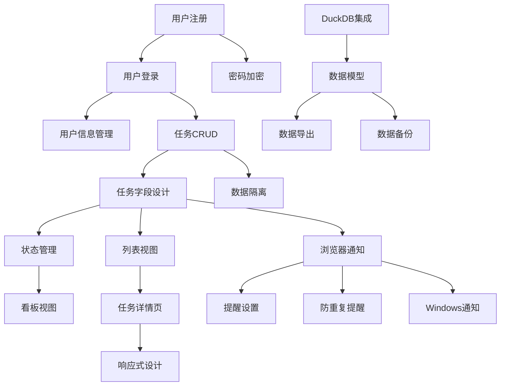

# S2 任务分解 - taskmaster-demo

**项目**: taskmaster-demo
**阶段**: S2_task_breakdown  
**创建时间**: 2025-08-15 17:27:07
**基于**: PRD文档分析

---

## 📋 项目概述

基于PRD文档分析，本项目是一个**多用户隔离个人任务管理系统**，主要特点：
- 多用户支持，数据完全隔离
- 简洁易用的任务管理界面（类Notion风格）
- 智能提醒功能（浏览器通知/Windows通知）
- 技术栈：Vue3 + FastAPI + DuckDB

## 🎯 核心功能模块分解

### 模块1: 用户管理系统
| 任务ID | 任务名称 | 描述 | 预估工时 | 优先级 | 依赖 |
|--------|----------|------|----------|--------|------|
| T-001 | 用户注册功能 | 实现用户名+密码注册，邮箱可选 | 4h | 高 | - |
| T-002 | 用户登录功能 | JWT认证，会话管理 | 3h | 高 | T-001 |
| T-003 | 密码加密存储 | 使用bcrypt加密用户密码 | 2h | 高 | T-001 |
| T-004 | 用户信息管理 | 头像上传，个人信息编辑 | 3h | 中 | T-002 |

### 模块2: 任务管理核心
| 任务ID | 任务名称 | 描述 | 预估工时 | 优先级 | 依赖 |
|--------|----------|------|----------|--------|------|
| T-005 | 任务CRUD操作 | 创建、查看、编辑、删除任务 | 6h | 高 | T-002 |
| T-006 | 任务字段设计 | 标题、描述(Markdown)、截止时间、优先级、状态 | 4h | 高 | T-005 |
| T-007 | 数据隔离机制 | 确保用户只能访问自己的任务 | 3h | 高 | T-005 |
| T-008 | 任务状态管理 | 待办/进行中/已完成状态转换 | 2h | 中 | T-006 |

### 模块3: 界面视图
| 任务ID | 任务名称 | 描述 | 预估工时 | 优先级 | 依赖 |
|--------|----------|------|----------|--------|------|
| T-009 | 列表视图 | 表格形式显示任务，支持排序过滤 | 5h | 高 | T-006 |
| T-010 | 看板视图 | 按状态分组，支持拖拽操作 | 6h | 中 | T-008 |
| T-011 | 任务详情页 | 弹窗或侧边栏编辑任务 | 4h | 中 | T-009 |
| T-012 | 响应式设计 | 适配桌面和移动端 | 4h | 低 | T-011 |

### 模块4: 提醒系统
| 任务ID | 任务名称 | 描述 | 预估工时 | 优先级 | 依赖 |
|--------|----------|------|----------|--------|------|
| T-013 | 浏览器通知 | 任务到期前弹窗提醒 | 4h | 高 | T-006 |
| T-014 | 提醒时间设置 | 用户自定义提醒提前量 | 2h | 中 | T-013 |
| T-015 | 防重复提醒 | 通知状态字段，避免重复弹窗 | 2h | 中 | T-013 |
| T-016 | Windows通知 | 系统级通知支持 | 3h | 低 | T-013 |

### 模块5: 数据管理
| 任务ID | 任务名称 | 描述 | 预估工时 | 优先级 | 依赖 |
|--------|----------|------|----------|--------|------|
| T-017 | DuckDB集成 | 数据库连接和基础操作 | 3h | 高 | - |
| T-018 | 数据模型设计 | users表和tasks表结构 | 2h | 高 | T-017 |
| T-019 | 数据导出功能 | CSV/JSON格式导出个人数据 | 3h | 低 | T-018 |
| T-020 | 数据备份机制 | 定期备份数据库 | 2h | 低 | T-018 |

## 🔄 任务依赖关系

## 📊 开发计划

### 第1周 (核心功能)
- **用户管理**: T-001, T-002, T-003 (9h)
- **任务核心**: T-005, T-006, T-007 (13h)
- **数据基础**: T-017, T-018 (5h)
- **总计**: 27h

### 第2周 (界面和提醒)
- **界面视图**: T-009, T-011 (9h)
- **提醒系统**: T-013, T-014, T-015 (8h)
- **状态管理**: T-008 (2h)
- **总计**: 19h

### 第3周 (扩展功能)
- **高级界面**: T-010, T-012 (10h)
- **数据管理**: T-019, T-020 (5h)
- **用户体验**: T-004, T-016 (6h)
- **总计**: 21h

## ✅ 质量检查点

### 数据安全检查
- [ ] 用户密码正确加密存储
- [ ] JWT token安全实现
- [ ] 数据隔离机制验证
- [ ] SQL注入防护

### 功能完整性检查
- [ ] 所有CRUD操作正常
- [ ] 提醒功能准确触发
- [ ] 界面响应式适配
- [ ] 数据导出功能正常

### 性能要求验证
- [ ] 支持5-50用户并发
- [ ] API响应时间 < 200ms
- [ ] 通知延迟 < 1分钟
- [ ] 数据库查询优化

## 🎯 下一阶段准备

**S3阶段输入**:
- 详细的任务分解清单
- 技术架构决策
- 数据模型设计
- 安全需求分析

**S3阶段目标**: 基于任务分解设计全面的测试用例，特别关注数据隔离和安全性测试。

---
*基于 AceFlow Standard 模式和 TaskMaster PRD 文档生成*
*下一阶段: S3_test_design*
